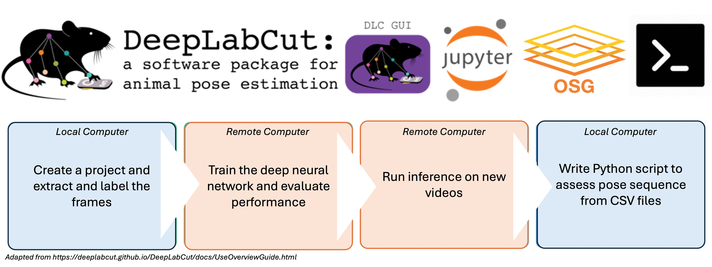
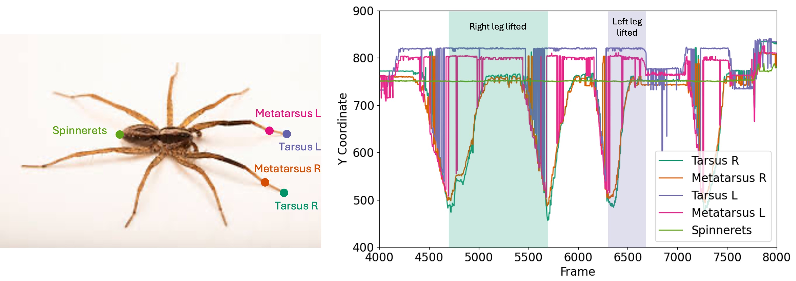
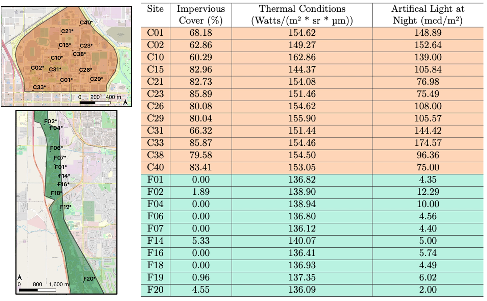
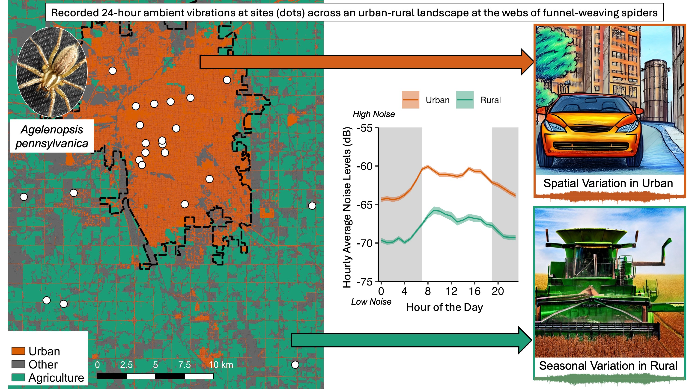
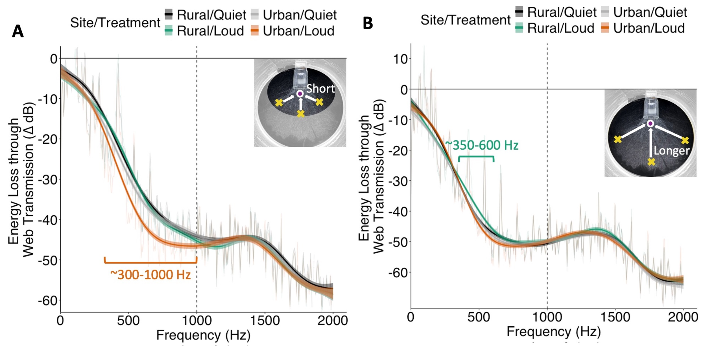
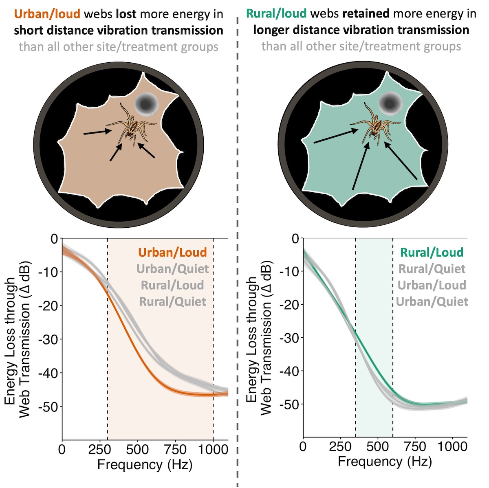

```{r setup, include = FALSE}
library(knitr)
library(kableExtra)
library(tidyverse)

knitr::opts_chunk$set(echo = FALSE)
options(knitr.table.format = "latex")
```

Lincoln, Nebraska, USA | [bjpessman@gmail.com](bjpessman@gmail.com) | [GitHub](https://github.com/brandipessman) | [LinkedIn](https://www.linkedin.com/in/brandipessman/)

# About Me

I am a data scientist with a Ph.D. from the University of Nebraska-Lincoln, where I developed a passion for uncovering patterns in complex datasets and translating them into actionable insights. My expertise lies in data analytics, predictive modeling, pipeline production, and geospatial analysis using tools like R, Python, SQL, high-throughput computing, and QGIS.

I excel at designing scalable workflows and predictive models that transform raw data into resolutions that drive decision-making and innovation. By applying advanced analytical techniques to biological systems, I have developed a deep understanding of complex, dynamic data - skills that translate to solving real-world challenges in business, technology, and environmental science. 

*Below are selected snippets of projects demonstrating experiences that align with the data scientist role at Penlink.*

# Featured Projects

```{r libraries, include = FALSE}
library(DBI)
library(RSQLite)
library(knitr)
library(kableExtra)
library(tidyverse)
library(ggmap) 
library(ggsn)
library(ggrepel) 
library(viridis) 
library(lme4)
library(reticulate)
```

## 1. Modeling Leg Movement Through Pattern Sequence Reconstruction 

* **Tech Stack**: Python, DeepLabCut, OSPool, HTCondor, High-Throughput Computing

* **Impact**: Applied machine learning and high-throughput computing to track and analyze spider leg movements in mating displays. This work automated behavioral analysis, reducing manual video annotation time and enhancing the study of motion patterns in biomechanics.

-- Built and implemented a DeepLabCut, a deep-learning pose estimation software, container to use on the remote servers of the Open Science Pool. 

-- Utilized machine learning to train the computer to learn key point positions on spider legs during courtship displays. 


```{r dlc, fig.align = "center", out.width = "75%"}

```

-- Wrote python scripts, shell scripts, and submission files for the HTCondor system.

*Python Script*
```python
import deeplabcut
import os
import sys

video = sys.argv[1]
config = "path"

current_directory = os.getcwd()
config_path = os.path.join(current_directory, config, 'config.yaml')
video_path = os.path.join(current_directory, video)
dest_path = os.path.join(current_directory, config, 'results')

deeplabcut.analyze_videos(config_path, [video_path], save_as_csv=True, 
                          destfolder=dest_path)
deeplabcut.filterpredictions(config_path, [video_path], destfolder=dest_path)
```

*Shell Script*
```sh
video=$1

mkdir -p /tmp/pretrained
ls /usr/local/lib
cp /usr/local/lib/python3.10/dist-packages/deeplabcut/pose_estimation_tensorflow/models/
    pretrained.ORIG/*.yaml /tmp/pretrained
cp /usr/local/lib/python3.10/dist-packages/deeplabcut/pose_estimation_tensorflow/models/
    pretrained.ORIG/*.py /tmp/pretrained

tar -xzf tar3_evaluated.tar.gz -C /srv
mkdir /srv/path/results

if [[ "$video" == *.MP4 ]]; then
    python3.10 deeplabcut_analysis.py $video

else
    echo "Unsupported video format: $video. Please use .MP4."
    exit 1
fi

tar -czf results_${video}.tar.gz path/
```

*Submission File*
```sh
video = $Fnx(videopath)
executable = deeplabcut_analysis.sh
arguments = $(video)

transfer_input_files = tar3_evaluated.tar.gz, deeplabcut_analysis.py, osdf://$(videopath)
transfer_output_remaps = "results_$(video).tar.gz = results/results_$(video).tar.gz"

universe = container
container_image = osdf:///path/DeepLabCut.sif

output = output/output_$(video).out
error = error/error_$(video).err
log = log/log_$(video).log

gpus_minimum_capability = 8.0
request_gpus = 1
request_cpus = 2
request_memory = 40GB 
request_disk = 25GB

requirements = regexp("GP-ARGO", GLIDEIN_ResourceName) != True && 
                     (GLIDEIN_ResourceName =!= MY.GLIDEIN_ResourceName0) && 
                     (GLIDEIN_ResourceName =!= MY.GLIDEIN_ResourceName1) && 
                     (GLIDEIN_ResourceName =!= MY.GLIDEIN_ResourceName2)

queue videopath matching path/*.MP4
```

-- Processed the resulting CSV file to graph the y-coordinates of different body parts of the spider across all video frames to predict leg movements.

```{r dlc results, out.width = "100%"}

```

*Selected Python Code Behind the Figure* 

```python
import pandas as pd
from pathlib import Path
import numpy as np
import os
import matplotlib.pyplot as plt

Dataframe = pd.read_csv(os.path.join('sg138-19_C0038_filtered.csv'))

df_melted_y = Dataframe.melt(id_vars=['coords'], 
                    value_vars=[col for col in Dataframe.columns if col.endswith('.y')],
                    var_name='bodypart', 
                    value_name='y')
                    
df_melted_lh = Dataframe.melt(id_vars=['coords'], 
                    value_vars=[col for col in Dataframe.columns if col.endswith('.lh')],
                    var_name='bodypart', 
                    value_name='lh')
df_melted_lh = df_melted_lh[df_melted_lh['lh'] > 0.5]

merged_df = pd.merge(df_melted_y, df_melted_lh, on=['coords'], how='left')
merged_df = merged_df.dropna()
merged_df = merged_df[merged_df['bodypart_x'].isin(['TR1.y', 'MR1.y', 'TL1.y', 
                                                    'ML1.y', 'S.y'])]

plt.figure(figsize=(10, 6))

unique_bodyparts = merged_df['bodypart_x'].unique()
plt.rcParams.update({'font.size': 16})

colors = plt.cm.Dark2(range(len(unique_bodyparts)))

for i, bodypart in enumerate(unique_bodyparts):
    bodypart_data = merged_df[merged_df['bodypart_x'] == bodypart]
    
    plt.plot(bodypart_data['coords'], bodypart_data['y'], label=bodypart, color=colors[i])

plt.xlabel('Frame')
plt.ylabel('Y Coordinate')

handles, labels = plt.gca().get_legend_handles_labels()
new_labels = ['Tarsus R', 'Metatarsus R', 'Tarsus L', 'Metatarsus L', 'Spinnerets'] 
plt.legend(handles, new_labels, loc="lower right")

plt.xlim(5000, 8000) 
plt.ylim(400, 900)

plt.show()
```


## 2. Predicting Population Dynamics Through Geospatial Analysis

* **Tech Stack**: R, QGIS, Geospatial Analysis, Predictive Modeling

* **Impact**: Used satellite imagery and environmental datasets to predict how environmental conditions impact spider populations. Insights from this study, published in a peer-reviewed journal, inform conservation strategies and demonstrate the power of spatial data in ecological research.

* **Github**: https://github.com/brandipessman/Agelenopsis_aggregation

* **Publication**: https://doi.org/10.1007/s11252-023-01379-z

-- Used publicly available GIS layers to assess environmental conditions at each of 22 sites (12 in city center - a, and 10 in city forest - b):

* National Land Cover Database - Impervious (building and pavement) Cover 2019

* Landsat-7 World Reference System-2 - Spectral Radiance 2020

* Visible Infrared Imaging Radiometer Suite (VIIRS) - Artificial Night Sky Radiance 2020


```{r layers, out.width = "100%"}
knitr::include_graphics("layers.jpg")
```

-- Leveraged QGIS to calculate the average of each variable in a 100m-radius buffer around each site to use in further analyses.

```{r gis, include = FALSE, message = FALSE, warning = FALSE, fig.width = 7}
layers <- readRDS("sites_wrangled.rds") %>% 
  select(ID, imperv100m, spec_rad, light_rad)
colnames(layers) <- c("Site", "Impervious Cover (%)", "Thermal Conditions (Watts/(m² * sr * µm))", "Artifical Light at Night (mcd/m²)")
kable(layers, align = 'c', digits = 2) %>%
  kable_classic() %>% 
  kable_styling(full_width = FALSE, latex_options = "hold_position") %>% 
  row_spec(c(1:12), background = "#fed6b7") %>% 
  row_spec(c(13:22), background = "#baf3e2") %>% 
  column_spec(2, width = "5em") %>% 
  column_spec(3, width = "13em") %>% 
  column_spec(4, width = "10em")
```


```{r sites, out.width = "100%"}

```

## 3. Mapping Vibratory Noise Levels in Cities 

* **Tech Stack**: R, QGIS, Raven Pro, Principal Component Analysis, Linear Mixed-Effect Models

* **Impact**: Developed spatial models to quantify vibratory noise levels in cities, integrating GIS mapping and statistical modeling. Findings, published in a peer-reviewed journal, provide critical insights into urban noise pollution and its ecological effects.

* **Github**: https://github.com/brandipessman/Vibratory_Noise 

* **Publication**: https://doi.org/10.1111/eea.13487

-- Recorded vibratory noise levels at 23 sites across urban (city) and rural (countryside) areas in Lincoln, Nebraska and mapped the daily average noise level for each site.

-- Utilized the *ggmap* package in R to map the coordinates of the recording sites, integrating data about average noise levels at each site. 

```{r map, echo = FALSE, message = FALSE, warning = FALSE, fig.align="center", fig.width = 4.5}
lincoln <- data.frame(read.table("lincoln_coordinates.txt", sep = "," , header = F)) %>% 
  slice(10:2350) %>% 
  separate(V1, c("extra", "longitude", "latitude"), " ") %>% 
  mutate(longitude = as.numeric(longitude),
         latitude = as.numeric(latitude))

sites <- read.csv("site_coordinates.csv", header = TRUE) %>% 
  mutate(Site = Sites, .keep = "unused") %>%
  full_join(readRDS("siteavgl.rds"), by = "Site") %>% 
  mutate(mean_leq = round(mean_leq),
         med_leq = round(med_leq)) %>% 
  mutate(choice = ifelse(Site == "8A" | Site == "8B", "Urban", 
                         ifelse(Site == "5A" | Site == "6C", "Rural", "Other")),
         choice = factor(choice),
         choice = fct_relevel(choice, "Rural", "Urban", "Other"))

# get background map
lancaster <- map_data("county") %>% 
  subset(region == "nebraska") %>% 
  subset(subregion == "lancaster")
lc_borders <- c(bottom  = min(lancaster$lat) + 0.05, 
                 top     = max(lancaster$lat)  - 0.13,
                 left    = min(lancaster$long) - 0.01,
                 right   = max(lancaster$long) - 0.05)
map <- get_stadiamap(lc_borders, zoom = 10, maptype = "stamen_toner")

ggmap(map) + 
  #add scalebar
  ggsn::scalebar(x.min = -96.9, x.max = -96.5, 
                 y.min = 40.57, y.max = 40.899,
                 dist = 5, dist_unit = "km", transform = TRUE,
                 location = "bottomleft", 
                 st.bottom = FALSE, box.color = c("black", "black"),
                 st.size = 4, border.size = 0.5, st.dist = 0.03) + 
  #add Lincoln outline/shading
  geom_polygon(data = lincoln, 
               aes(x = longitude, y = latitude), 
               fill = "slategray", alpha = 0.25, color = "gray30") +
  # add sites and labels
  geom_point(data = sites, 
             mapping = aes(x = Longitude, y = Latitude), 
             pch=21, size = 1, fill = "black") +
  geom_label_repel(aes(x =Longitude, y = Latitude, 
                       fill = mean_leq, label = mean_leq), 
                   min.segment.length = 0.1, max.overlaps = Inf, 
                   size = 2, data = sites) +
  scale_fill_viridis(name = "Noise Level \n(dB)", option = "C") +
  ylab("Latitude") + xlab("Longitude") +
  labs(fill = "Avg. Noise Level (dB)") +
  theme_classic() + 
  theme(panel.border = element_rect(colour = "black", fill=NA, size=1),
        legend.position = c(0.75, 0.07),
        legend.direction = "horizontal",
        legend.background = element_rect(fill = "white",
                                  size = 0.5, linetype = "solid", 
                                  colour ="black"),
        legend.key.height = unit(0.15, 'cm'),
        legend.key.width = unit(0.4, 'cm'),
        text = element_text(size = 10, color = "black", family = "sans"),
        axis.text = element_text(size = 10, color = "black", family = "sans"),
        legend.text = element_text(size = 8, family = "sans"),
        legend.title = element_text(size = 8, family = "sans"))
```

*Selected R Code Behind the Map*

```r
# get background map
lancaster <- map_data("county") %>% 
  subset(region == "nebraska") %>% 
  subset(subregion == "lancaster")
lc_borders <- c(bottom  = min(lancaster$lat)  + 0.05, 
                top     = max(lancaster$lat)  - 0.13,
                left    = min(lancaster$long) - 0.01,
                right   = max(lancaster$long) - 0.05)
map <- get_stadiamap(lc_borders, zoom = 10, maptype = "stamen_toner")

ggmap(map) + 
  # add scalebar
  ggsn::scalebar(x.min = -96.9, x.max = -96.5, 
                 y.min = 40.57, y.max = 40.899,
                 dist = 5, dist_unit = "km", transform = TRUE,
                 location = "bottomleft", 
                 st.bottom = FALSE, box.color = c("black", "black"),
                 st.size = 4, border.size = 0.5, st.dist = 0.03) + 
  # add Lincoln outline/shading
  geom_polygon(data = lincoln, 
               aes(x = longitude, y = latitude), 
               fill = "slategray", alpha = 0.25, color = "gray30") +
  # add sites and labels
  geom_point(data = sites, 
             mapping = aes(x = Longitude, y = Latitude), 
             pch=21, size = 1, fill = "black") +
  # aesthetics
  geom_label_repel(aes(x =Longitude, y = Latitude, 
                       fill = mean_leq, label = mean_leq), 
                       min.segment.length = 0.1, max.overlaps = Inf, 
                       size = 2, data = sites) +
  scale_fill_viridis(name = "Noise Level \n(dB)", option = "C") +
  ylab("Latitude") + xlab("Longitude") +
  labs(fill = "Avg. Noise Level (dB)") +
  theme_classic() + 
  theme(panel.border = element_rect(colour = "black", fill=NA, size=1),
        legend.position = c(0.75, 0.07),
        legend.direction = "horizontal",
        legend.background = element_rect(fill = "white",
                                  size = 0.5, linetype = "solid", 
                                  colour ="black"),
        legend.key.height = unit(0.15, 'cm'),
        legend.key.width = unit(0.4, 'cm'),
        text = element_text(size = 10, color = "black", family = "sans"),
        axis.text = element_text(size = 10, color = "black", family = "sans"),
        legend.text = element_text(size = 8, family = "sans"),
        legend.title = element_text(size = 8, family = "sans"))
```

-- Performed a Principal Component Analysis (PCA) in R to reduce dimensions of traffic disturbance variables and used a linear mixed-effect model (LMM) to test whether vibratory noise levels correlated with our traffic disturbance principal component.

```{r lmer, echo = FALSE, message = FALSE, warning = FALSE, fig.align = "center", fig.width = 4, fig.height = 2.75}
# graph
dayavgl <- readRDS("dayavgl.rds")
spatial_dayavgl <- dayavgl %>% 
  ungroup() %>% 
  dplyr::select(Site, Category, Substrate, Dim.1, Dim.2, mean_leq) %>% 
  group_by(Site, Substrate, Category, Dim.1, Dim.2) %>% 
  summarize(mean = mean(mean_leq),
            sd = sd(mean_leq))
highlights <- dayavgl %>% 
  filter(mean_leq == max(dayavgl$mean_leq) | mean_leq == min(dayavgl$mean_leq)) %>% 
  mutate(mean_leq = round(mean_leq, 2))

# linear mixed effect model
dayavgl.lmer <- lmer(mean_leq ~ Dim.1 + (1|Site), data = dayavgl)
predictions <- expand.grid(Dim.1 = seq(-3.5, 2.5, 0.05))
predictions$response <- predict(dayavgl.lmer, newdata = predictions, se.fit = TRUE, re.form = NA, type = "response")
bigBoot_spatial <- readRDS("bigBoot_spatial.Rds")
predSE <- t(apply(bigBoot_spatial$t, MARGIN = 2, FUN = sd))
predictions$SE <- predSE[1, ]

# graph
ggplot() +
  annotate("rect", xmin = -3.75, xmax = -1.5, ymin = -73, ymax = -57,
           alpha = 0.25, color = "#1B9E77", fill = NA, linewidth = 1) +
  annotate("rect", xmin = -0.5, xmax = 2.5, ymin = -69, ymax = -50,
           alpha = 0.25, color = "#D95F02", fill = NA, linewidth = 1) +
  annotate("text", x = 1, y = -49, color = "#D95F02", label = "Urban (City)", size = 3) +
  annotate("text", x = -2.6, y = -56, color = "#1B9E77", label = "Rural (Country)", size = 3) +
  geom_point(aes(x = Dim.1, y = mean), data = spatial_dayavgl, color = "black", position = position_dodge(width = 0.25), size = 1) +
  geom_errorbar(aes(x = Dim.1, ymax = mean + sd, ymin = mean - sd), width = 0, data = spatial_dayavgl, color = "black", position = position_dodge(width = 0.25), linewidth = 0.4) +
  geom_point(aes(x = Dim.1, y = mean_leq), color = "red", data = highlights) +
  geom_line(aes(x = Dim.1, y = response), data = predictions, color = "black") +
  geom_ribbon(aes(x = Dim.1, ymax = response + SE, ymin = response - SE), data = predictions, color = "black", fill = "black", alpha = 0.5) +
  geom_label_repel(aes(x = Dim.1, y = mean_leq, label = mean_leq), color = "red", hjust = "right", data = highlights, size = 2) +
  xlab("Traffic Disturbance (PC1, explains 70.9%)") +
  ylab("Daily Average Noise Levels (dB)") +
  scale_y_continuous(limits = c(-75, -48), breaks = c(-75, -70, -65, -60, -55, -50)) +
  scale_x_continuous(limits = c(-3.75, 2.65), breaks = c(-3, -2, -1, 0, 1, 2)) +
  theme_classic() +
  theme(text = element_text(size = 9, color = "black", family = "sans"),
        axis.text = element_text(size = 9, color = "black", family = "sans"),
        axis.title = element_text(size = 9, color = "black", family = "sans"),
        panel.grid.major.y = element_line(colour = "black", linetype = "dashed", linewidth = 0.1))
```

*Selected R Code Building the Model and Calculating the Predictions*

```r
noise.lmer <- lmer(noise_levels ~ PC1 + (1|site), data = daily_levels)

predictions <- expand.grid(PC1 = seq(-3.5, 2.5, 0.05))
predictions$response <- predict(noise.lmer, newdata = predictions, 
                                se.fit = TRUE, re.form = NA, type = "response")

BootFunc <- function(mm) {
    predict(mm, newdata = predictions, re.form = ~0, type = "response")
}

bigBoot_spatial <- bootMer(noise.lmer, BootFunc, nsim = 1000)
predSE <- t(apply(bigBoot_spatial$t, MARGIN = 2, FUN = sd))
predictions$SE <- predSE[1, ]
```

-- Created a graphical summary of the findings that is featured in the publication in a peer-reviewed journal. The map was created using QGIS.


```{r ga, out.width = "100%"}

```

## 4. Testing Noise Impacts On Vibrations Transmission Through Spider Webs

* **Tech Stack**: R, Raven Pro, Generalized Additive Models, Pairwise Comparisons

* **Impact**: Uncovered how environmental noise influences vibratory properties of spider webs, revealing that spiders may adapt their web-building strategies to optimize signal transmission in noisy conditions. 

* **GitHub**: https://github.com/brandipessman/Vibration_Transmission

-- Engineered a novel method to measure energy loss as vibrations transmit across spider webs when vibrations were introduced at two distances. 

-- Tested Generalized Additive Models and pairwise comparisons of the estimated marginal means to compare how webs differed within the range of noise (below 1000 Hz) and outside the range of noise (above 1000 Hz). 

-- Employed a fully crossed design where spiders collected from rural (country) and urban (city) constructed webs under quiet (reflecting rural) or loud (reflecting urban) conditions.

```{r figure, fig.align = "center", out.width = "75%"}

```

*R Code Constructing the Model and Calculating Predictions*

```r
gam_model <- gam(energy_loss ~  Site/Treatment + s(Frequency, by = Site/Treatment, k = 10), 
                 data = short)
gam_model_null <- gam(energy_loss ~ 1, data = short)
anova(gam_model_null, gam_model, test = "F")
c(AIC(gam_model), AIC(gam_model_null))
pairs(emmeans(gam_model, ~Site/Treatment))

nd <- data.frame(expand.grid(Frequency = seq(0, 2000, 5),
                             Site = levels(factor(short$Site)),
                             Treatment = levels(factor(short$Treatment))))
nd <- nd %>% 
  unite("Site/Treatment", Site, Treatment, sep = "_", remove = FALSE)
predictions <- data.frame(predict(gam_model, newdata = nd, type = "response", 
                       se.fit = TRUE))
predictions <- cbind(nd, predictions)
```

-- Translated the figure to make a more engaging graphical summary to draw readers to the paper. 

```{r graph_abs, fig.align = "center", out.width = "50%"}

```

## 5. Assessing the Social Network of High School Students

* **Tech Stack**: SQL

* **Impact**: Built SQL queries to analyze relational data on student friendships, uncovering patterns in social interactions. 

-- Wrote queries as part of the Stanford Online Course: *Relational Databases and SQL*

*Here are the database structures:*

```{r load databases, include = FALSE}
con <- dbConnect(SQLite(), ":memory:")
dbExecute(con, "CREATE TABLE Highschooler (
                ID INTEGER PRIMARY KEY,
                name TEXT,
                grade INTEGER
              )")
dbExecute(con, "INSERT INTO Highschooler (ID, name, grade) VALUES 
                (1510, 'Jordan', 9),
                (1689, 'Gabriel', 9),
                (1381, 'Tiffany', 9),
                (1709, 'Cassandra', 9),
                (1101, 'Haley', 10),
                (1782, 'Andrew', 10),
                (1468, 'Kris', 10),
                (1641, 'Brittany', 10),
                (1247, 'Alexis', 11),
                (1316, 'Austin', 11),
                (1911, 'Gabriel', 11),
                (1501, 'Jessica', 11),
                (1304, 'Jordan', 12),
                (1025, 'John', 12),
                (1934, 'Kyle', 12),
                (1661, 'Logan', 12)")
dbExecute(con, "CREATE TABLE Friend (
                ID1 INTEGER,
                ID2 INTEGER
              )")
dbExecute(con, "INSERT INTO Friend (ID1, ID2) VALUES 
                (1510, 1381),
                (1510, 1689),
                (1689, 1709),
                (1381, 1247),
                (1709, 1247),
                (1689, 1782),
                (1782, 1468),
                (1782, 1316),
                (1782, 1304),
                (1468, 1101),
                (1468, 1641),
                (1101, 1641),
                (1247, 1911),
                (1247, 1501),
                (1911, 1501),
                (1501, 1934),
                (1316, 1934),
                (1934, 1304),
                (1304, 1661),
                (1661, 1025),
                (1381, 1510),
                (1689, 1510),
                (1709, 1689),
                (1247, 1381),
                (1247, 1709),
                (1782, 1689),
                (1468, 1782),
                (1316, 1782),
                (1304, 1782),
                (1101, 1468),
                (1641, 1468),
                (1641, 1101),
                (1911, 1247),
                (1501, 1247),
                (1501, 1911),
                (1934, 1501),
                (1934, 1316),
                (1304, 1934),
                (1661, 1304),
                (1025, 1661)")
dbExecute(con, "CREATE TABLE Likes (
                ID1 INTEGER,
                ID2 INTEGER
              )")
dbExecute(con, "INSERT INTO Likes (ID1, ID2) VALUES 
              (1689, 1709),
              (1709, 1689),
              (1782, 1709),
              (1911, 1247),
              (1247, 1468),
              (1641, 1468),
              (1316, 1304),
              (1501, 1934),
              (1934, 1501),
              (1025, 1101)")
```

**Highschooler** ( ID, name, grade )

There is a high school student with unique ID and a given first name in a certain grade.

**Friend** ( ID1, ID2 )

The student with ID1 is friends with the student with ID2. Friendship is mutual, so if (123, 456) is in the Friend table, so is (456, 123).

**Likes** ( ID1, ID2 )

The student with ID1 likes the student with ID2. Liking someone is not necessarily mutual, so if (123, 456) is in the Likes table, there is no guarantee that (456, 123) is also present.

*Selected exercises*

*Ex1.* For every student who likes someone 2 or more grades younger than themselves, return that student's name and grade, and the name and grade of the student they like.

```sql
select H1.name as name1, H1.grade as grade1, H2.name as name2, H2.grade as grade2
from Highschooler H1 
	join Likes L on H1.ID = L.ID1 
	join Highschooler H2 on L.ID2 = H2.ID
where H1.grade - H2.grade > 1
```

```{r q2, echo = FALSE}
query <- dbGetQuery(con, "select H1.name as name1, H1.grade as grade1, H2.name as name2, H2.grade as grade2
from Highschooler H1 
	join Likes L on H1.ID = L.ID1 
	join Highschooler H2 on L.ID2 = H2.ID
where H1.grade - H2.grade > 1")
kable(query) %>%
  kable_classic() %>% 
  kable_styling(full_width = FALSE, position = "center", latex_options = "hold_position")
```

*Ex2.* For every pair of students who both like each other, return the name and grade of both students. Include each pair only once, with the two names in alphabetical order.

```sql
select H1.name as name1, H1.grade as grade1, H2.name as name2, H2.grade as grade2
from Likes L1 
  join Likes L2 on L1.ID1 = L2.ID2 and L1.ID2 = L2.ID1
  join Highschooler H1 on L1.ID1 = H1.ID 
  join Highschooler H2 on L1.ID2 = H2.ID
where H1.name < H2.name
```

```{r q3, echo = FALSE}
query <- dbGetQuery(con, "select H1.name as name1, H1.grade as grade1, H2.name as name2, H2.grade as grade2
from Likes L1 
join Likes L2 on L1.ID1 = L2.ID2 and L1.ID2 = L2.ID1
join Highschooler H1 on L1.ID1 = H1.ID 
join Highschooler H2 on L1.ID2 = H2.ID
where H1.name < H2.name")
kable(query) %>%
  kable_classic() %>% 
  kable_styling(full_width = FALSE, position = "center", latex_options = "hold_position")
```


*Ex3.* Find all students who do not appear in the Likes table (as a student who likes or is liked) and return their names and grades. Sort by grade, then by name within each grade.

```sql
select name, grade
from Highschooler
where ID not in (select ID1 from Likes) and ID not in (select ID2 from Likes)
order by grade, name
```

```{r q4, echo = FALSE}
query <- dbGetQuery(con, "select name, grade
from Highschooler
where ID not in (select ID1 from Likes) and ID not in (select ID2 from Likes)
order by grade, name")
kable(query) %>%
  kable_classic() %>% 
  kable_styling(full_width = FALSE, position = "center", latex_options = "hold_position")
```

