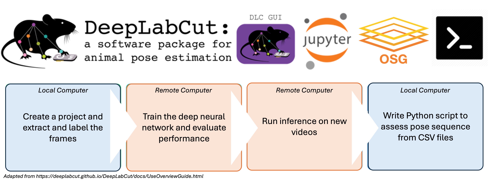
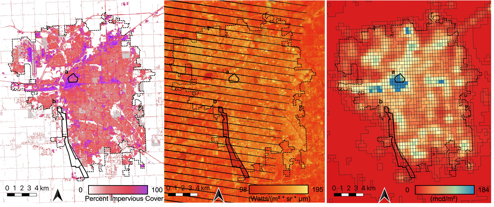
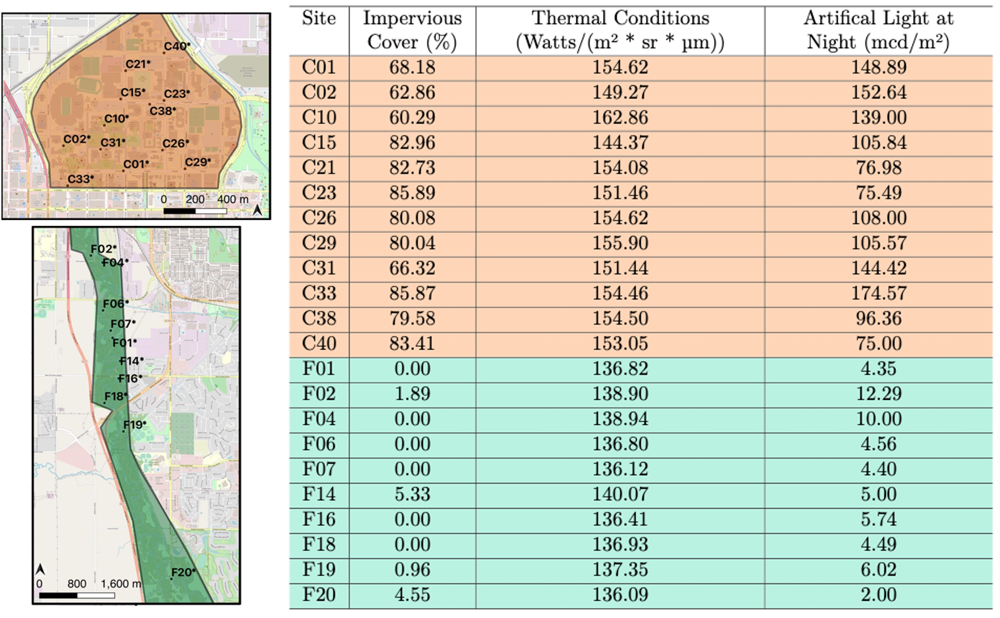
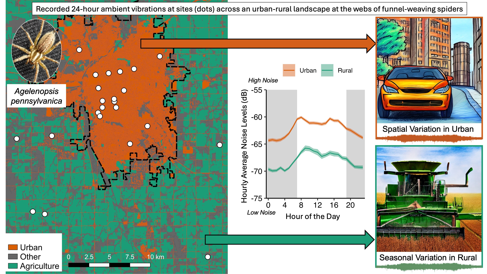

```{r setup, include = FALSE}
knitr::opts_chunk$set(echo = FALSE)
options(knitr.table.format = "latex")
```

```{r libraries, include = FALSE}
library(DBI)
library(RSQLite)
library(knitr)
library(kableExtra)
library(tidyverse)
library(ggmap) 
library(ggsn)
library(ggrepel) 
library(viridis) 
library(lme4)
library(reticulate)
library(MASS) 
library(broom)
library(ggpubr)
library(MuMIn)
library(broom.mixed)
library(FactoMineR)
library(factoextra)
library(lubridate)
library(emmeans)
library(mgcv)
```

```{r import, include = FALSE}
sites_wrangled <- readRDS("sites_wrangled.rds")
neighbors_wrangled <- readRDS("neighbors_wrangled.rds") 
webs_wrangled <- readRDS("webs_wrangled.rds")
dayavgl_2020 <- readRDS("dayavgl.rds") %>% 
  filter(Date < "2021-01-01") 
season_dayavgl_2020 <- dayavgl_2020 %>% 
  ungroup() %>% 
  dplyr::select(Site, Visit, Category, mean_leq) %>% 
  group_by(Category, Visit) %>% 
  summarise(mean = mean(mean_leq),
            sd = sd(mean_leq))
vibration_transmission2 <- readRDS(file = "vibration_transmission2.rds")
```

Lincoln, Nebraska, USA | [bjpessman@gmail.com](bjpessman@gmail.com) | [GitHub](https://github.com/brandipessman) | [LinkedIn](https://www.linkedin.com/in/brandipessman/)

# About Me

I am a data scientist with a Ph.D. from the University of Nebraska-Lincoln, where I developed a passion for uncovering patterns in complex datasets and translating them into actionable insights. My expertise lies in data analytics, visualizations, predictive modeling, pipeline production, and geospatial analysis using tools like R, Python, SQL, Unix, Git, high-throughput computing, and QGIS.

I excel at designing scalable workflows and predictive models that transform raw data into resolutions that drive decision-making and innovation. By applying advanced analytical techniques to biological systems, I have developed a deep understanding of complex, dynamic data - skills that translate to solving real-world challenges in business, technology, and other professional settings. 

*Below are selected snippets of projects demonstrating my relevant experiences. Code behind the graphics and tables can be expanded throughout to showcase my skills in data wrangling, statistical analysis, and visualization using Python, R, or SQL languages.*

# Featured Projects

## Modeling Computer-Trained Poses [Python]
**ONGOING**

```{r dlc, fig.align = "center", out.width = "75%"}

```

<br>

* **Tech Stack**: Python, Unix, DeepLabCut, OSPool, HTCondor, High-Throughput Computing

* **Motivation**: Quantify leg movements during mating displays across 22 species of wolf spiders (~1000 videos) to test if the complexity of visual displays are predictable across species. 

* **Impact**: Applied machine learning and high-throughput computing to automate behavioral analysis, reducing manual video annotation time and enhancing the study of motion patterns in biomechanics.

<br>

-- Built and implemented a container for DeepLabCut, a deep-learning pose estimation software, to use on the remote servers of the Open Science Pool (OSPool). 

-- Utilized machine learning to train the computer to learn key point positions on spider legs during mating displays. 

-- Designed an efficient workflow on the remote server to train the model, evaluate the network, and run inference on 1000 videos.

-- Collaborated with a brilliant research team who recorded the videos, extracted and labeled frames, and are working to group species with similar visual displays.

<br>

### Remote Computer Scripts {.tabset}

<br>

-- Wrote scripts that communicate with each other on the remote server to run a defined job - in this case, to use a trained model to estimate poses frame-by-frame. 

<br>

#### Python Script

<br>

This script sets the directory of the selected videos and runs functions in the DeepLabCut container that runs inference from the trained model on all videos in the specified path. 

<br>

```sh
import deeplabcut
import os
import sys

video = sys.argv[1]
config = "path"

current_directory = os.getcwd()
config_path = os.path.join(current_directory, config, 'config.yaml')
video_path = os.path.join(current_directory, video)
dest_path = os.path.join(current_directory, config, 'results')

deeplabcut.analyze_videos(config_path, [video_path], save_as_csv=True, 
                          destfolder=dest_path)
deeplabcut.filterpredictions(config_path, [video_path], destfolder=dest_path)
```

#### Shell Script

<br>

This scipt runs some necessary commands to ensure the DeepLabCut container is communicating with all necessary directories. It implements safeguards to ensure videos are properly formatted before running the Python script and tarring the results for output.

<br>

```sh
video=$1

mkdir -p /tmp/pretrained
ls /usr/local/lib
cp /usr/local/lib/python3.10/dist-packages/deeplabcut/pose_estimation_tensorflow/models/
    pretrained.ORIG/*.yaml /tmp/pretrained
cp /usr/local/lib/python3.10/dist-packages/deeplabcut/pose_estimation_tensorflow/models/
    pretrained.ORIG/*.py /tmp/pretrained

tar -xzf tar3_evaluated.tar.gz -C /srv
mkdir /srv/path/results

if [[ "$video" == *.MP4 ]]; then
    python3.10 deeplabcut_analysis.py $video

else
    echo "Unsupported video format: $video. Please use .MP4."
    exit 1
fi

tar -czf results_${video}.tar.gz path/
```

#### Submission File

<br>

This script is necessary for the HTConder system to distribute jobs to the pool of servers. It defines the input/output files, container location, computer requirements, and queue statement to parallel-process videos. 

<br> 

```sh
video = $Fnx(videopath)
executable = deeplabcut_analysis.sh
arguments = $(video)

transfer_input_files = tar3_evaluated.tar.gz, deeplabcut_analysis.py, osdf://$(videopath)
transfer_output_remaps = "results_$(video).tar.gz = results/results_$(video).tar.gz"

universe = container
container_image = osdf:///path/DeepLabCut.sif

output = output/output_$(video).out
error = error/error_$(video).err
log = log/log_$(video).log

gpus_minimum_capability = 8.0
request_gpus = 1
request_cpus = 2
request_memory = 40GB 
request_disk = 25GB

requirements = regexp("GP-ARGO", GLIDEIN_ResourceName) != True && 
                     (GLIDEIN_ResourceName =!= MY.GLIDEIN_ResourceName0) && 
                     (GLIDEIN_ResourceName =!= MY.GLIDEIN_ResourceName1) && 
                     (GLIDEIN_ResourceName =!= MY.GLIDEIN_ResourceName2)

queue videopath matching path/*.MP4
```

<br>

### Visualizing Leg Movement

<br>

-- Processed the resulting CSV file to graph the y-coordinates of different body parts of the spider across video frames to predict leg movements.

The spinnerets act as a baseline because the line should be horizontally flat if the spider is not moving. The left leg was raised where the pink/purple lines rise and likewise for the right leg with the orange/green lines. Further analysis can categorize patterns of rising/lowering legs and cluster by species. 

<br>

```{r dlc results, out.width = "100%"}
knitr::include_graphics("positions.jpg")
```

```python
import pandas as pd
from pathlib import Path
import numpy as np
import os
import matplotlib.pyplot as plt

Dataframe = pd.read_csv(os.path.join('sg138-19_C0038_filtered.csv'))

df_melted_y = Dataframe.melt(id_vars=['coords'], 
                    value_vars=[col for col in Dataframe.columns if col.endswith('.y')],
                    var_name='bodypart', 
                    value_name='y')
                    
df_melted_lh = Dataframe.melt(id_vars=['coords'], 
                    value_vars=[col for col in Dataframe.columns if col.endswith('.lh')],
                    var_name='bodypart', 
                    value_name='lh')
df_melted_lh = df_melted_lh[df_melted_lh['lh'] > 0.5]

merged_df = pd.merge(df_melted_y, df_melted_lh, on=['coords'], how='left')
merged_df = merged_df.dropna()
merged_df = merged_df[merged_df['bodypart_x'].isin(['TR1.y', 'MR1.y', 'TL1.y', 
                                                    'ML1.y', 'S.y'])]

plt.figure(figsize=(10, 6))

unique_bodyparts = merged_df['bodypart_x'].unique()
plt.rcParams.update({'font.size': 16})

colors = plt.cm.Dark2(range(len(unique_bodyparts)))

for i, bodypart in enumerate(unique_bodyparts):
    bodypart_data = merged_df[merged_df['bodypart_x'] == bodypart]
    
    plt.plot(bodypart_data['coords'], bodypart_data['y'], label=bodypart, color=colors[i])

plt.xlabel('Frame')
plt.ylabel('Y Coordinate')

handles, labels = plt.gca().get_legend_handles_labels()
new_labels = ['Tarsus R', 'Metatarsus R', 'Tarsus L', 'Metatarsus L', 'Spinnerets'] 
plt.legend(handles, new_labels, loc="lower right")

plt.xlim(5000, 8000) 
plt.ylim(400, 900)

plt.show()
```

<br>

---

## Predicting Population Dynamics [R]

[**PUBLISHED**](https://doi.org/10.1007/s11252-023-01379-z)

<br>

* **Tech Stack**: R, QGIS, AIC Model Selection, Negative Binomial GLM, Geospatial Analysis, Predictive Modeling

* **Motivation**: To predict how environmental conditions in cities impact how spiders position themselves in their three-dimensional environment.

* **Impact**: Used satellite imagery and environmental datasets to inform conservation strategies and demonstrate the power of spatial data in ecological research. The findings point to a strong role of traffic disturbance in spider spatial patterns, which led to additional experiments (see Mapping City Noise Levels and Testing Web Vibration Transmission).

* **Github**: https://github.com/brandipessman/Agelenopsis_aggregation

* **Publication**: https://doi.org/10.1007/s11252-023-01379-z

<br>

### Negative Binomial GLMs {.tabset}

<br>

-- Assessed spider abundance, aggregation, and web height at two distinct city habitats: a city center and a city forest.

<br>

*The graphs show the raw data (grey or transparent points) and the mean (orange/green points) and standard error (errorbars) predicted by the negative binomial generalized linear mixed models (GLMM). I chose this statistical test because the measurements were overdispersed count data.*

<br>

#### Abundance

<br>

**Spiders were more abundant in the city center than the city forest (*z~20~* = 3.13, *P* = 0.002).** Resources may be abundant in densely-populated and heavily-disturbed city centers where these spiders appear to thrive.

<br>

```{r abundance, echo = TRUE, message = FALSE, warning = FALSE, fig.align="center", fig.width = 3.5, fig.height = 3, collapse = TRUE}
# Negative Binomial Generalized Linear Model
spider.nb <- glm.nb(NumSpiders ~ Location, data = sites_wrangled)

# Calculate Model Predictions
nd <- data.frame(Location = factor(levels(sites_wrangled$Location)))
predictions <- augment(spider.nb, newdata = nd, se_fit = TRUE, type.predict = "response")
predictions <- predictions %>% 
  rename("rate" = ".fitted", "SE" = ".se.fit")

# Plot the Model Predictions and Raw Data
ggplot(sites_wrangled, aes(x = Location, y = NumSpiders)) + 
  geom_jitter(color = "grey", width = 0.1) +
  geom_point(aes(x = Location, y = rate, color = Location), 
             size = 2, data = predictions) + 
  geom_errorbar(aes(x = Location, ymin = rate - SE, ymax = rate + SE, color = Location), 
                data = predictions, inherit.aes = FALSE, width = 0.15, size = 1) +
  scale_color_manual(values = c("Urban Center" = "#d95f02", "Urban Forest" = "#1b9e77")) +
  scale_x_discrete(labels=c("Urban Forest" = "City \nForest \nN = 10", 
                            "Urban Center" = "City \nCenter \nN = 12")) +
  scale_y_continuous(limits = c(0, 25), breaks = c(0, 5, 10, 15, 20, 25)) +
  ylab("Number of Spiders") + 
  theme_classic() +
  theme(text = element_text(size = 12),
        axis.text.x = element_text(colour = "black", size = 12),
        axis.text.y = element_text(colour = "black", size = 12),
        axis.title.x = element_blank(),
        legend.position = "none") 
```

#### Aggregation

<br>

**Spiders were more aggregated - meaning a spider's two nearest neighbors were closer - in the city center than the city forest (*z~34~* = -5.02, *P* < 0.001).** Fragmentation and smaller patch sizes in the city center may lead spiders to clump in areas of suitable habitat (e.g., abundant prey, structure for webs, reduced threats, etc.).

<br>

```{r aggregation, echo = TRUE, message = FALSE, warning = FALSE, fig.align="center", fig.width = 3.5, fig.height = 3, collapse = TRUE}
# Negative Binomial Generalized Linear Mixed Model
dist.nb <- glmer.nb(round(RetreatDist, 0) ~ Location * factor(Neighbor) + (1 | ID), 
                    data = neighbors_wrangled)

# Calculate Model Predictions
predictions <- expand.grid(Location = levels(factor(neighbors_wrangled$Location)), 
                           Neighbor = levels(factor(neighbors_wrangled$Neighbor)))
predictions$response <- predict(dist.nb, newdata = predictions, 
                                se.fit = TRUE, re.form = NA, type = "response")
BootFunc <- function(mm) {
    predict(mm, newdata = predictions, re.form = ~0, type = "response")
}
  #bigBoot_neighbors_nb <- bootMer(neighbor.nb, get_predictions, nsim = 1000)
bigBoot_neighbors_nb <- readRDS("bigBoot_neighbors_nb.Rds") 
predSE <- t(apply(bigBoot_neighbors_nb$t, MARGIN = 2, FUN = sd, na.rm = TRUE))
predictions$SE <- predSE[1, ]

# Graph the Model Predictions and Raw Data
ggplot(neighbors_wrangled, aes(x = Neighbor, y = RetreatDist)) + 
  geom_jitter(aes(color = Location), alpha = 0.5, width = 0.1) +
    geom_line(aes(x = Neighbor, y = response, group = Location), 
              size = 2, data = predictions, color = "grey") +
  geom_point(aes(x = Neighbor, y = response, color = Location), 
             size = 2, data = predictions) + 
  geom_errorbar(aes(x = Neighbor, ymin = response - SE, ymax = response + SE, 
                    color = Location), 
                data = predictions, inherit.aes = FALSE, width = 0.15, size = 1) +
  scale_color_manual(values = c("Urban Center" = "#d95f02", "Urban Forest" = "#1b9e77")) +
  scale_x_discrete(labels=c("Urban Forest" = "Urban \nForest \nN = 10", 
                            "Urban Center" = "Urban \nCenter \nN = 12")) +
  scale_y_continuous(limits = c(-50, 1050), breaks = c(0, 200, 400, 600, 800, 1000)) +
  xlab("Nearest Neighbors") +
  ylab("Distance from Focal Web \nto Neighbor Web [cm]") + 
  theme_classic() +
  theme(text = element_text(size = 12),
        axis.text.x = element_text(colour = "black", size = 12),
        axis.text.y = element_text(colour = "black", size = 12),
        legend.position = "none")
```

#### Web Height

<br>

**Spider webs were lower in the city center than the city forest (*z~128~* = -2.44, *P* = 0.015).** Perhaps spiders build webs lower in the city center to capture different types of prey or because frequenct lawn maintenance forces lower webs. On the other hand, city forest spiders may build higher to avoid destruction by small mammals.

<br>

```{r height, echo = TRUE, message = FALSE, warning = FALSE, fig.align="center", fig.width = 3.5, fig.height = 3, collapse = TRUE}
# Negative Binomial Generalized Linear Mixed Model
height.nb <- glmer.nb(round(RetreatHeight, 0) ~ Location + (1 | ID), data = webs_wrangled)

# Calculate Model Predictions
predictions <- expand.grid(Location = levels(factor(webs_wrangled$Location)))
predictions$response <- predict(height.nb, newdata = predictions, 
                                se.fit = TRUE, re.form = NA, type = "response")
  #bigBoot_height_nb <- bootMer(height.nb, BootFunc, nsim = 1000)
bigBoot_height_nb <- readRDS("bigBoot_height_nb.Rds")
predSE <- t(apply(bigBoot_height_nb$t, MARGIN = 2, FUN = sd))
predictions$SE <- predSE[1, ]

# Graph Model Predictions and Raw Data
ggplot(webs_wrangled, aes(x = Location, y = RetreatHeight)) + 
  geom_jitter(color = "grey", width = 0.1) +
  geom_point(aes(x = Location, y = response, color = Location), 
             size = 2, data = predictions) +
  geom_errorbar(aes(x= Location, ymin = response - SE, ymax = response + SE, color = Location), 
                data = predictions, inherit.aes = FALSE, width = 0.15, size = 1) +
    scale_color_manual(values = c("Urban Center" = "#d95f02", "Urban Forest" = "#1b9e77")) +
    scale_x_discrete(labels=c("Urban Forest" = "City \nForest \nN = 30", 
                              "Urban Center" = "City \nCenter \nN = 101")) +
    scale_y_continuous(limits = c(0, 210), breaks = c(0, 35, 70, 105, 140, 175, 210)) +
    ylab("Web Height [cm]") + 
    theme_classic() +
    theme(text = element_text(size = 12),
          axis.text.x = element_text(colour = "black", size = 12),
          axis.text.y = element_text(colour = "black", size = 12),
          axis.title.x = element_blank(),
          legend.position = "none") 
```

<br>

### AIC Model Selection {.tabset}

<br>

-- Gathered environmental variables suspected to impact spider distributions in cities. 

* Plant species richness - the number of unique plant species in a 10m-radius of a spider web
  
|             *Justification: The focal system needs plant structure for web construction.*
  
* Road- and highway-traffic impact - the daily average number of cars that pass on the nearest road or highway
  
|             *Justification: Vibrations produced by traffic may disturb spider senses.*

<br> 

-- Wrote a function, that takes the response variable as the input, to perform Akaike Information Criteria (AIC) model selection for identifying the environmental variables that best predict spider spatial patterns. 

*Click the button to reveal the code for the function.*
```r
library(MuMIn) # to run the dredge function
library(tidyverse) # for wrangling
library(MASS) # negative binomial tests

aic_selection <- function(y_var, data) {
  # List predictors for each subset
  predictors_overall <- c("log_TotalSub", "log_tdr", "log_tdh")
  predictors_forest <- c("tree100m", "log_TotalSub", "log_tdh", "log_patch", "log_tdr")
  predictors_center <- c("log_TotalSub", "log_tdr", "log_tdh", "spec_rad", "log_patch", "road_length_m")

  # create subsets of data
  data_overall <- data
  data_forest <- data %>% 
    filter(Location == "Urban Forest")
  data_center <- data %>% 
    filter(Location == "Urban Center")
  
  # Performing glm and dredge
  run_analysis <- function(predictors, y_var, data_subset) {
    
    formula <- as.formula(paste(y_var, "~", paste(predictors, collapse = " + ")))
    
    # fit the global model
    global <- glm.nb(formula, data = data_subset)
    
    # Run dredge for model selection
    options(na.action = "na.fail") # Required for dredge to run
    model_dredge <- dredge(global, beta = "none", evaluate = TRUE, rank = AICc)
    options(na.action = "na.omit") # Set back to default
    
    # Models within 2 delta AIC
    model_selection <- model.sel(model_dredge)
    model_selection <- model_selection %>% 
      filter(delta < 2)
    
    # Get the top model
    top_model <- get.models(model_dredge, subset = 1)[[1]]
    
    # Extract the summary of the top model
    model_summary <- summary(top_model)
    
    # Extract coefficient table (including standard errors)
    info <- coef(model_summary)
    
    # Extract exponentiated coefficients (and standard errors) for all predictors
    coeffs <- list()
    for (var in predictors) {
      if (var %in% rownames(info)) {
        coeffs[[var]] <- c(exp(info[var, 1]), exp(info[var, 2]))  # Exponentiated coefficients
      } else {
        coeffs[[var]] <- NA  # Handle case where the predictor is not in the top model
      }
    }
    
    # Calculate R squared value
    r_squared <- with(model_summary, 1 - deviance / null.deviance)
    
    # Check VIF for multicollinearity
    # Check VIF for multicollinearity, only if there are more than 1 predictor
    vif_values <- if (length(coef(top_model)) > 2) {
      car::vif(top_model)
    } else {
      NA  # VIF cannot be computed for models with fewer than 2 predictors
    }    
    # return the results as a list
    return(list(
      model_summary = model_summary,
      r_squared = r_squared,
      model_selection = model_selection,
      vif_values = vif_values,
      coefficients = coeffs
    ))
  }
  
  # Run the analysis for each subset
  overall_results <- run_analysis(predictors_overall, y_var, data_overall)
  forest_results <- run_analysis(predictors_forest, y_var, data_forest)
  center_results <- run_analysis(predictors_center, y_var, data_center)
  
  # Return results for all three analyses
  return(list(
    overall = overall_results,
    forest = forest_results,
    center = center_results
  ))
  
}
```

#### Abundance

<br>

Disturbances from road-traffic did not significantly predict spider abundance across sites, as it was removed from the global model during model selection procedures.

```{r abundance aic, echo = TRUE, results = 'show', message = FALSE, warning = FALSE, collapse = TRUE}
# Global Model
global <- glm.nb(NumSpiders ~ log_TotalSub + log_tdr + log_tdh, data = sites_wrangled)
summary_global <- data.frame(coef(summary(global)))

# Format the Table
rownames(summary_global) <- c("(Intercept)", "Plant Species Richness", "Road-Traffic Impact", "Highway-Traffic Impact")
summary_global <- summary_global %>%
  mutate(Pr...z.. = round(Pr...z.., digits = 3), 
         Pr...z.. = ifelse(Pr...z.. == 0, "< 0.001", Pr...z..),
         Pr...z.. = ifelse(Pr...z.. < 0.001, paste0(Pr...z.., "***"),
                   ifelse(Pr...z.. < 0.01, paste0(Pr...z.., "**"),
                   ifelse(Pr...z.. < 0.05, paste0(Pr...z.., "*"), Pr...z..))))
colnames(summary_global) <- c("Estimate", "Std. Error", "z-value", "P-value")

# Make the Table
kable(summary_global, digits = 3, caption = "Global Model Summary") %>% 
  kable_classic() %>% 
  kable_styling(full_width = FALSE, position = "center")
# Perform Model Selection
options(na.action = "na.fail")
model_dredge <- dredge(global, beta = "none", evaluate = T, rank = AICc)
options(na.action = "na.omit") 
top_model_spiders_o <- get.models(model_dredge, subset = 1)[[1]]
summary_spider <- data.frame(coef(summary(top_model_spiders_o)))

# Format the Table
rownames(summary_spider) <- c("(Intercept)", "Highway-Traffic Impact", "Plant Species Richness")
summary_spider <- summary_spider %>%
  mutate(Pr...z.. = round(Pr...z.., digits = 3), 
         Pr...z.. = ifelse(Pr...z.. == 0, "< 0.001", Pr...z..),
         Pr...z.. = ifelse(Pr...z.. < 0.001, paste0(Pr...z.., "***"),
                   ifelse(Pr...z.. < 0.01, paste0(Pr...z.., "**"),
                   ifelse(Pr...z.. < 0.05, paste0(Pr...z.., "*"), Pr...z..))))
colnames(summary_spider) <- c("Estimate", "Std. Error", "z-value", "P-value")

# Make the Table
kable(summary_spider, digits = 3, caption = "Top Model Summary") %>% 
  kable_classic() %>% 
  kable_styling(full_width = FALSE, position = "center")
```

<br>

**Spider abundance was negatively impacted by more unique plant species and higher traffic disturbance from highways.** Sites with lower plant diversity may have few plant species that are highly preferred, leading to higher spider abundance. Traffic, especially on heavily-traveled routes like highways, can produce noise that disturbs spider senses.

```{r abundance aic graph, echo = TRUE, message = FALSE, warning = FALSE, fig.align="center", fig.width = 7, fig.height = 3, collapse = TRUE}
coloro = "black"

# Get the Model Predictions - Plant Species Richness
nd <- data.frame(log_TotalSub = seq(0, 3.2, 0.03), 
                 log_tdh = mean(sites_wrangled$log_tdh))
predicted.distance <- augment(top_model_spiders_o, newdata = nd, se_fit = TRUE)

# Graph Plant Species Richness
spiders_plant <- ggplot(sites_wrangled, aes(x = log_TotalSub, y = log(NumSpiders))) + 
  geom_point(aes(color = Location), 
             alpha = 0.7, size = 1) +
  geom_line(aes(x = log_TotalSub, y = .fitted), 
            size = 1, color = coloro, data = predicted.distance) + 
  geom_ribbon(aes(x = log_TotalSub,
                  ymin = .fitted - 1.96 * .se.fit, ymax = .fitted + 1.96 * .se.fit), 
              fill = coloro, data = predicted.distance, inherit.aes = FALSE, alpha = 0.25) +
  scale_y_continuous(limits = c(-2, 5), breaks = c(-2, 0, 2, 4)) +  
  scale_color_manual(values = c("Urban Center" = "#d95f02", "Urban Forest" = "#1b9e77")) +
  xlab("Plant Species Richness [ln()]") +
  ylab("Number of Spiders [ln()]") + 
  theme_classic() +
  theme(text = element_text(size = 12),
        legend.text = element_text(size = 12),
        axis.text.x = element_text(colour = "black", size = 12),
        axis.text.y = element_text(colour = "black", size = 12),
        legend.position = "top") + 
    annotate(geom = "text", x = min(predicted.distance$log_TotalSub) + 
               diff(range(predicted.distance$log_TotalSub))/2, 
             y = 5, label = "***", color = "black", size = 6)

# Get Model Predictions - Highway-Traffic Impact
nd <- data.frame(log_TotalSub = mean(sites_wrangled$log_TotalSub), 
                 log_tdh = seq(2.7, 5.5, 0.03))
predicted.distance <- augment(top_model_spiders_o, newdata = nd, se_fit = TRUE)

# Graph Highway-Traffic Impact
spiders_tdh <- ggplot(sites_wrangled, aes(x = log_tdh, y = log(NumSpiders))) + 
  geom_point(aes(color = Location), 
             alpha = 0.7, size = 1) +
  geom_line(aes(x = log_tdh, y = .fitted), 
            size = 1,color = coloro, data = predicted.distance) + 
  geom_ribbon(aes(x = log_tdh, 
                  ymin = .fitted - 1.96 * .se.fit, ymax = .fitted + 1.96 * .se.fit), 
              fill = coloro, data = predicted.distance, inherit.aes = FALSE, alpha = 0.25) +
  scale_y_continuous(limits = c(-2, 5), breaks = c(-2, 0, 2, 4)) +  
  scale_x_continuous(breaks = c(3, 4, 5)) +  
  scale_color_manual(values = c("Urban Center" = "#d95f02", "Urban Forest" = "#1b9e77")) +
  xlab("Highway Disturbance [ln(vehicles/day/m)]") +
  ylab("Number of Spiders [ln()]") + 
  theme_classic() +
  theme(text = element_text(size = 12),
        legend.text = element_text(size = 12),
        axis.text.x = element_text(colour = "black", size = 12),
        axis.text.y = element_text(colour = "black", size = 12),
        legend.position = "top") + 
  annotate(geom = "text", x = min((predicted.distance$log_tdh)) + 
             diff(range((predicted.distance$log_tdh)))/2, 
           y = 5, label = "*", color = "black", size = 6)

ggarrange(spiders_plant, spiders_tdh, ncol = 2, common.legend = TRUE)
```

#### Aggregation

<br>

Traffic disturbances (from neither roads nor highways) did not significantly predict spider aggregations, as these predictors were removed from the global model during model selection procedures.

```{r aggregation aic, echo = TRUE, results = 'show', message = FALSE, warning = FALSE, collapse = TRUE}
nearest <- neighbors_wrangled %>% 
  filter(Web == "W002")

# Global Model
global <- glm.nb(round(RetreatDist, 0) ~ log_TotalSub + log_tdr + log_tdh, data = nearest)
summary_global <- data.frame(coef(summary(global)))

# Format the Table
rownames(summary_global) <- c("(Intercept)", "Plant Species Richness", "Road-Traffic Impact", "Highway-Traffic Impact")
summary_global <- summary_global %>%
  mutate(Pr...z.. = round(Pr...z.., digits = 3), 
         Pr...z.. = ifelse(Pr...z.. == 0, "< 0.001", Pr...z..),
         Pr...z.. = ifelse(Pr...z.. < 0.001, paste0(Pr...z.., "***"),
                   ifelse(Pr...z.. < 0.01, paste0(Pr...z.., "**"),
                   ifelse(Pr...z.. < 0.05, paste0(Pr...z.., "*"), Pr...z..))))
colnames(summary_global) <- c("Estimate", "Std. Error", "z-value", "P-value")

# Make the Table
kable(summary_global, digits = 3, caption = "Global Model Summary") %>% 
  kable_classic() %>% 
  kable_styling(full_width = FALSE, position = "center")
# Perform Model Selection
options(na.action = "na.fail") 
model_dredge <- dredge(global, beta = "none", evaluate = T, rank = AICc)
options(na.action = "na.omit") 
top_model_neighbor_o <- get.models(model_dredge, subset = 1)[[1]]
summary_nearest <- data.frame(coef(summary(top_model_neighbor_o)))

# Format the Table
rownames(summary_nearest) <- c("(Intercept)", "Plant Species Richness")
summary_nearest <- summary_nearest %>%
  mutate(Pr...z.. = round(Pr...z.., digits = 3), 
         Pr...z.. = ifelse(Pr...z.. == 0, "< 0.001", Pr...z..),
         Pr...z.. = ifelse(Pr...z.. < 0.001, paste0(Pr...z.., "***"),
                   ifelse(Pr...z.. < 0.01, paste0(Pr...z.., "**"),
                   ifelse(Pr...z.. < 0.05, paste0(Pr...z.., "*"), Pr...z..))))
colnames(summary_nearest) <- c("Estimate", "Std. Error", "z-value", "P-value")

# Make the Table
kable(summary_nearest, digits = 3, caption = "Top Model Summary") %>% 
  kable_classic() %>% 
  kable_styling(full_width = FALSE, position = "center")
```

<br>

**Spiders were more aggregated at sites with less diverse plants.** Perhaps this spider prefers a certain plant, or type of plant, especially in the city center where plants are clumped in space.

```{r aggregation aic graph, echo = TRUE, message = FALSE, warning = FALSE, fig.align="center", fig.width = 4, fig.height = 3, collapse = TRUE}
# Get Model Predictions
nd <- data.frame(log_TotalSub = seq(0, 3.2, 0.03))
predicted.distance <- augment(top_model_neighbor_o, 
                              newdata = nd, 
                              se_fit = TRUE)

# Graph Plant Species Richness
ggplot(nearest, aes(x = log_TotalSub, y = log(RetreatDist))) + 
  geom_point(aes(color = Location), 
             alpha = 0.7, size = 1) +
  geom_line(aes(x = log_TotalSub, y = .fitted), 
            size = 1, color = coloro, data = predicted.distance) + 
  geom_ribbon(aes(x = log_TotalSub, 
                  ymin = .fitted - 1.96 * .se.fit, ymax = .fitted + 1.96 * .se.fit), 
              fill = coloro, data = predicted.distance, inherit.aes = FALSE, alpha = 0.25) +
  scale_y_continuous(limits = c(2, 7.3), breaks = c(2, 3, 4, 5, 6, 7)) +  
  scale_color_manual(values = c("Urban Center" = "#d95f02", "Urban Forest" = "#1b9e77")) +
  xlab("Plant Species Richness [ln()]") +
  ylab("Distance from Focal Web \nto Neighbor Web [ln(cm)]") + 
  theme_classic() +
  theme(text = element_text(size = 12),
        axis.text.x = element_text(colour = "black", size = 12),
        legend.text = element_text(size = 12),
        axis.text.y = element_text(colour = "black", size = 12),
        legend.position = "top") +
  annotate(geom = "text", x = min(predicted.distance$log_TotalSub) + 
             diff(range(predicted.distance$log_TotalSub))/2, 
           y = 7, label = "**", color = "black", size = 6)
```

#### Web Height

<br>

Disturbances from highway-traffic did not significantly predict spider web height across sites, as it was removed from the global model during model selection procedures.

```{r height aic, echo = TRUE, results = 'show', message = FALSE, warning = FALSE, collapse = TRUE}
# Global Model
global <- glmer.nb(round(RetreatHeight, 0) ~ log_TotalSub + log_tdr + log_tdh + (1 | ID), 
                   data = webs_wrangled)
summary_global <- data.frame(coef(summary(global)))

# Format the Table
rownames(summary_global) <- c("(Intercept)", "Plant Species Richness", "Road-Traffic Impact", "Highway-Traffic Impact")
summary_global <- summary_global %>%
  mutate(Pr...z.. = round(Pr...z.., digits = 3), 
         Pr...z.. = ifelse(Pr...z.. == 0, "< 0.001", Pr...z..),
         Pr...z.. = ifelse(Pr...z.. < 0.001, paste0(Pr...z.., "***"),
                   ifelse(Pr...z.. < 0.01, paste0(Pr...z.., "**"),
                   ifelse(Pr...z.. < 0.05, paste0(Pr...z.., "*"), Pr...z..))))
colnames(summary_global) <- c("Estimate", "Std. Error", "z-value", "P-value")

# Make the Table
kable(summary_global, digits = 3, caption = "Global Model Summary") %>% 
  kable_classic() %>% 
  kable_styling(full_width = FALSE, position = "center")
# Perform Model Selection
options(na.action = "na.fail") 
model_dredge <- dredge(global, beta = "none", evaluate = TRUE, rank = AICc)
options(na.action = "na.omit") 
top_model_height_o <- get.models(model_dredge, subset = 1)[[1]]
summary_height <- data.frame(coef(summary(top_model_height_o)))

# Format the Table
rownames(summary_height) <- c("(Intercept)", "Road-Traffic Impact", "Plant Species Richness")
summary_height <- summary_height %>%
  mutate(Pr...z.. = round(Pr...z.., digits = 3), 
         Pr...z.. = ifelse(Pr...z.. == 0, "< 0.001", Pr...z..),
         Pr...z.. = ifelse(Pr...z.. < 0.001, paste0(Pr...z.., "***"),
                   ifelse(Pr...z.. < 0.01, paste0(Pr...z.., "**"),
                   ifelse(Pr...z.. < 0.05, paste0(Pr...z.., "*"), Pr...z..))))
colnames(summary_height) <- c("Estimate", "Std. Error", "z-value", "P-value")

# Make the Table
kable(summary_height, digits = 3, caption = "Top Model Summary") %>% 
  kable_classic() %>% 
  kable_styling(full_width = FALSE, position = "center")
```

<br>

**Webs were constructed higher at sites with more diverse plants. Web height was not impacted by road-traffic.** Sites with more diverse plants might provide opportunities for higher webs.

```{r height aic graph, echo = TRUE, message = FALSE, warning = FALSE, fig.align="center", fig.width = 7, fig.height = 3, collapse = TRUE}
# Get Model Predictions
predictions <- expand.grid(log_TotalSub = seq(0, 3.15, 0.03),
                           log_tdr = mean(webs_wrangled$log_tdr))
predictions$response <- predict(top_model_height_o, newdata = predictions, 
                                se.fit = TRUE, re.form = NA, type = "response")
  #bigBoot_height_overall_plant_nb <- bootMer(top_model_height_o, BootFunc, nsim = 1000)
bigBoot_height_overall_plant_nb <- readRDS("bigBoot_height_overall_plant_nb.Rds")
predSE <- t(apply(bigBoot_height_overall_plant_nb$t, MARGIN = 2, FUN = sd))
predictions$SE <- predSE[1, ]

# Graph Model Predictions - Plant Species Richness
height_plant <- ggplot(webs_wrangled, aes(x = log_TotalSub, y = log(RetreatHeight))) + 
  geom_point(aes(color = Location), 
             alpha = 0.7, size = 1) +
  geom_line(aes(x = log_TotalSub, y = log(response)), 
            size = 1, color = coloro, data = predictions) + 
  geom_ribbon(aes(x = log_TotalSub, 
                  ymin = log(response - 1.96 * SE), ymax = log(response + 1.96 * SE)), 
              fill = coloro, data = predictions, inherit.aes = FALSE, alpha = 0.25) +
  scale_y_continuous(limits = c(-2.5, 6), breaks = c(-2, 0, 2, 4, 6)) + 
  scale_color_manual(values = c("Urban Center" = "#d95f02", "Urban Forest" = "#1b9e77")) +
  xlab("Plant Species Richness [ln()]") +
  ylab("Web Height [ln(cm)]") + 
  theme_classic() +
  theme(text = element_text(size = 12),
        legend.text = element_text(size = 12),
        axis.text.x = element_text(colour = "black", size = 12),
        axis.text.y = element_text(colour = "black", size = 12),
        legend.position = "top") + 
    annotate(geom = "text", x = min(predictions$log_TotalSub) + 
               diff(range(predictions$log_TotalSub))/2, 
             y = 5.8, label = "**", color = "black", size = 6)

# Get Model Predictions
predictions <- expand.grid(log_TotalSub = mean(webs_wrangled$log_TotalSub),
                           log_tdr = seq(2.73, 7.22, 0.05))
predictions$response <- predict(top_model_height_o, newdata = predictions, 
                                se.fit = TRUE, re.form = NA, type = "response")
  #bigBoot_height_overall_tdr_nb <- bootMer(top_model_height_o, BootFunc, nsim = 1000)
bigBoot_height_overall_tdr_nb <- readRDS("bigBoot_height_overall_tdr_nb.Rds")
predSE <- t(apply(bigBoot_height_overall_tdr_nb$t, MARGIN = 2, FUN = sd))
predictions$SE <- predSE[1, ]

# Graph Model Predictions - Road-Traffic Impact
height_tdr <- ggplot(webs_wrangled, aes(x = log_tdr, y = log(RetreatHeight))) + 
  geom_point(aes(color = Location), 
             alpha = 0.7, size = 1) +
  geom_line(aes(x = log_tdr, y = log(response)), 
            size = 1, color = coloro, data = predictions) + 
  geom_ribbon(aes(x = log_tdr, 
                  ymin = log(response - 1.96 * SE), ymax = log(response + 1.96 * SE)), 
              fill = coloro, data = predictions, inherit.aes = FALSE, alpha = 0.25) +
  scale_y_continuous(limits = c(-2.5, 6), breaks = c(-2, 0, 2, 4, 6)) +  
  scale_color_manual(values = c("Urban Center" = "#d95f02", "Urban Forest" = "#1b9e77")) +
  xlab("Road Disturbance [ln(vehicles/day/m)]") +
  ylab("Web Height [ln(cm)]") + 
  theme_classic() +
  theme(text = element_text(size = 12),
        legend.text = element_text(size = 12),
        axis.text.x = element_text(colour = "black", size = 12),
        axis.text.y = element_text(colour = "black", size = 12),
        legend.position = "top") + 
  annotate(geom = "text", x = min(predictions$log_tdr) + diff(range(predictions$log_tdr))/2, 
           y = 5.8, label = "N. S.", color = "black", size = 4)

ggarrange(height_plant, height_tdr, ncol = 2, common.legend = TRUE)
```

<br>

### Geospatial Analysis with QGIS

<br>

-- Used publicly available GIS layers to compare environmental conditions between city center (a) and city forest (b):

* National Land Cover Database - Impervious (building and pavement) Cover 2019

* Landsat-7 World Reference System-2 - Spectral Radiance 2020

* Visible Infrared Imaging Radiometer Suite (VIIRS) - Artificial Night Sky Radiance 2020

<br>

```{r layers, out.width = "100%"}

```

<br>

-- Leveraged QGIS to calculate the average of each variable in a 100m-radius buffer around each site to use in further analyses.

<br>

```{r gis, include = FALSE, message = FALSE, warning = FALSE, fig.width = 7}
layers <- readRDS("sites_wrangled.rds") %>% 
  dplyr::select(ID, imperv100m, spec_rad, light_rad)
colnames(layers) <- c("Site", "Impervious Cover (%)", "Thermal Conditions \n(Watts/(m² * sr * µm))", "Artifical Light at Night \n(mcd/m²)")
kable(layers, align = 'c', digits = 2) %>%
  kable_classic() %>% 
  kable_styling(full_width = FALSE, latex_options = "hold_position") %>% 
  row_spec(c(1:12), background = "#fed6b7") %>% 
  row_spec(c(13:22), background = "#baf3e2") %>% 
  column_spec(2, width = "5em") %>% 
  column_spec(3, width = "13em") %>% 
  column_spec(4, width = "10em") %>% 
  save_kable("table.png")
```

```{r sites, out.width = "100%"}

```

<br>

---

## Mapping City Noise Levels [R]

[**PUBLISHED**](https://doi.org/10.1111/eea.13487)

```{r ga, out.width = "100%"}

```

<br>

* **Tech Stack**: R, QGIS, Raven Pro, Principal Component Analysis, Linear Mixed-Effect Models, Time Series

* **Motivation**: To spatially and temporally quantify vibratory noise levels in cities experienced by a common city spider.

* **Impact**: Developed spatial and time series models, integrating GIS mapping and statistical modeling. Findings provide critical insights into noise pollution and its likely impact on diverse wildlife.

* **Github**: https://github.com/brandipessman/Vibratory_Noise 

* **Publication**: https://doi.org/10.1111/eea.13487

<br>

### Spatial Noise Variation {.tabset}

<br>

**City spiders are more likely impacted by spatial variation in vibratory noise related to traffic than country spiders.**

<br>

#### Noise Map

<br>

-- Recorded vibratory noise levels at 23 sites across urban (within city limits in shaded grey area) and rural (countryside) areas in Lincoln, Nebraska and mapped the daily average noise level for each site.

-- Utilized the *ggmap* package in R to map the coordinates of the recording sites, integrating data about average noise levels at each site. 

**Sites within city limits are noisier (yellow/pink/orange), especially those near major highways (black lines), than those in the countryside.**

```{r map, echo = TRUE, message = FALSE, warning = FALSE, fig.align="center", fig.width = 4.5}
# Get the Lincoln City Limits Outline
lincoln <- data.frame(read.table("lincoln_coordinates.txt", sep = "," , header = F)) %>% 
  slice(10:2350) %>% 
  separate(V1, c("extra", "longitude", "latitude"), " ") %>% 
  mutate(longitude = as.numeric(longitude),
         latitude = as.numeric(latitude))

# Bring in Site Coordinates
sites <- read.csv("site_coordinates.csv", header = TRUE) %>% 
  mutate(Site = Sites, .keep = "unused") %>%
  full_join(readRDS("siteavgl.rds"), by = "Site") %>% 
  mutate(mean_leq = round(mean_leq),
         med_leq = round(med_leq)) %>% 
  mutate(choice = ifelse(Site == "8A" | Site == "8B", "Urban", 
                  ifelse(Site == "5A" | Site == "6C", "Rural", "Other")),
         choice = factor(choice),
         choice = fct_relevel(choice, "Rural", "Urban", "Other"))

# get background map
lancaster <- map_data("county") %>% 
  subset(region == "nebraska") %>% 
  subset(subregion == "lancaster")
lc_borders <- c(bottom   = min(lancaster$lat)  + 0.05, 
                 top     = max(lancaster$lat)  - 0.13,
                 left    = min(lancaster$long) - 0.01,
                 right   = max(lancaster$long) - 0.05)
map <- get_stadiamap(lc_borders, zoom = 10, maptype = "stamen_toner")

# Make the Map
ggmap(map) + 
  #add scalebar
  ggsn::scalebar(x.min = -96.9, x.max = -96.5, 
                 y.min = 40.57, y.max = 40.899,
                 dist = 5, dist_unit = "km", transform = TRUE,
                 location = "bottomleft", 
                 st.bottom = FALSE, box.color = c("black", "black"),
                 st.size = 4, border.size = 0.5, st.dist = 0.03) + 
  #add Lincoln outline/shading
  geom_polygon(data = lincoln, 
               aes(x = longitude, y = latitude), 
               fill = "slategray", alpha = 0.25, color = "gray30") +
  # add sites and labels
  geom_point(data = sites, 
             mapping = aes(x = Longitude, y = Latitude), 
             pch=21, size = 1, fill = "black") +
  geom_label_repel(aes(x =Longitude, y = Latitude, 
                       fill = mean_leq, label = mean_leq), 
                   min.segment.length = 0.1, max.overlaps = Inf, 
                   size = 2, data = sites) +
  scale_fill_viridis(name = "Noise Level \n(dB)", option = "C") +
  ylab("Latitude") + xlab("Longitude") +
  labs(fill = "Avg. Noise Level (dB)") +
  theme_classic() + 
  theme(panel.border = element_rect(colour = "black", fill=NA, size=1),
        legend.position = c(0.75, 0.07),
        legend.direction = "horizontal",
        legend.background = element_rect(fill = "white",
                                  size = 0.5, linetype = "solid", 
                                  colour ="black"),
        legend.key.height = unit(0.15, 'cm'),
        legend.key.width = unit(0.4, 'cm'),
        text = element_text(size = 10, color = "black", family = "sans"),
        axis.text = element_text(size = 10, color = "black", family = "sans"),
        legend.text = element_text(size = 8, family = "sans"),
        legend.title = element_text(size = 8, family = "sans"))
```

<br>

#### PCA

<br>

-- Performed a Principal Component Analysis (PCA) in R to reduce dimensions of traffic disturbance variables: 

* *Traffic Distance* - Distance to nearest road
* *Traffic* - Daily number of cars to pass on nearest road
* *Road Length* - Total road length in 100m-radius of recording site
* *Impervious* - Percent impervious (i.e., buildings, pavement) cover in 100m-radius

**Principal Component 1 includes contributions from all traffic disturbance variables and explains much of the variation (70.9%), making it a good indicator of traffic disturbance.** The horizontal divide between country (green) and city (orange) recording sites suggests that all city sites have a higher probability of being disturbed by traffic.

```{r pca, echo = TRUE, message = FALSE, warning = FALSE, fig.align = "center", fig.width = 5.5, fig.height = 5}
# Wrangle the Data
pca <- read.table("pca_noise.txt", header = TRUE)
colnames(pca) <- c('Impervious','Road Distance','Traffic Distance', 'Traffic', 'Road Length', 'Traffic Impact', 'Category')
pca <- pca %>% 
  filter(! Category == "Forest") %>% 
  mutate(Category = fct_relevel(factor(Category), "Urban", "Rural"))
pca <- pca[, c(1, 3, 4, 5, 2, 6, 7)]

# Perform the PCA
site_pca <- PCA(pca[,1:4], graph = FALSE)

# Make the Graph
fviz_pca_biplot(site_pca,
                repel = TRUE,
                fill.ind = pca$Category,
                col.ind = pca$Category,
                palette = c("#D95F02", "#1B9E77"),
                label = "var",
                labelsize = 4,
                pointsize = 3,
                pointshape = 21,
                axes.linetype = "dotted",
                mean.point = FALSE,
                col.var = "grey40",
                xlab = "Principal Component 1 (70.9%)",
                ylab = "Principal Component 2 (18.3%)",
                title = "",
                ggtheme = theme_classic() + 
                  theme(text = element_text(size = 12))) +
  xlim(-3.5, 3.5) +
  ylim(-1.5, 2.5) +
  theme(legend.position = "none",
        axis.text.x = element_text(colour = "black", size = 12, 
                                   family = "sans"),
        axis.text.y = element_text(colour = "black", size = 12, 
                                   family = "sans"),
        axis.title.x = element_text(colour = "black", size = 12, 
                                    family = "sans"),
        axis.title.y = element_text(colour = "black", size = 12, 
                                    family = "sans")) 
```

#### LMM

<br>

-- Used a linear mixed-effect model (LMM) to predict vibratory noise levels based on the level of potential traffic disturbance.

*Each point and errorbar represents the calculated mean and standard deviation of all recordings at a site on a particular substrate type (two substrate types were recorded at each site). The line and error ribbon represent the mean and standard error from the predictions of the LMM. The red points represent the single loudest and quietest recordings. I included site as a random effect because sites were represented more than once in the model.*

**Higher traffic disturbance correlated with elevated vibratory noise levels (*t-value* = 5.856, *N* = 295, *P* < 0.001).** Traffic likely contributes significantly to vibratory noise pollution.

```{r lmer, echo = TRUE, message = FALSE, warning = FALSE, fig.align = "center", fig.width = 4, fig.height = 3.5}
# Wrangle Data
dayavgl <- readRDS("dayavgl.rds")
spatial_dayavgl <- dayavgl %>% 
  ungroup() %>% 
  dplyr::select(Site, Category, Substrate, Dim.1, Dim.2, mean_leq) %>% 
  group_by(Site, Substrate, Category, Dim.1, Dim.2) %>% 
  summarize(mean = mean(mean_leq),
            sd = sd(mean_leq))
highlights <- dayavgl %>% 
  filter(mean_leq == max(dayavgl$mean_leq) | 
           mean_leq == min(dayavgl$mean_leq)) %>% 
  mutate(mean_leq = round(mean_leq, 2))

# Linear Mixed Model
dayavgl.lmer <- lmer(mean_leq ~ Dim.1 + (1|Site), data = dayavgl)

# Calculate Model Predictions
predictions <- expand.grid(Dim.1 = seq(-3.5, 2.5, 0.05))
predictions$response <- predict(dayavgl.lmer, newdata = predictions, se.fit = TRUE, re.form = NA, type = "response")
bigBoot_spatial <- readRDS("bigBoot_spatial.Rds")
predSE <- t(apply(bigBoot_spatial$t, MARGIN = 2, FUN = sd))
predictions$SE <- predSE[1, ]

# Graph Model Predictions and Raw Data
ggplot() +
  annotate("rect", xmin = -3.75, xmax = -1.5, ymin = -73, ymax = -57,
           alpha = 0.25, color = "#1B9E77", fill = NA, linewidth = 1) +
  annotate("rect", xmin = -0.5, xmax = 2.5, ymin = -69, ymax = -50,
           alpha = 0.25, color = "#D95F02", fill = NA, linewidth = 1) +
  annotate("text", x = 1, y = -49, color = "#D95F02", 
           label = "Urban (City)", size = 3) +
  annotate("text", x = -2.6, y = -56, color = "#1B9E77", 
           label = "Rural (Country)", size = 3) +
  geom_point(aes(x = Dim.1, y = mean), 
             data = spatial_dayavgl, color = "black", 
             position = position_dodge(width = 0.25), size = 1) +
  geom_errorbar(aes(x = Dim.1, ymax = mean + sd, ymin = mean - sd), 
                width = 0, data = spatial_dayavgl, color = "black", 
                position = position_dodge(width = 0.25), linewidth = 0.4) +
  geom_point(aes(x = Dim.1, y = mean_leq), 
             color = "red", data = highlights) +
  geom_line(aes(x = Dim.1, y = response), 
            data = predictions, color = "black") +
  geom_ribbon(aes(x = Dim.1, ymax = response + SE, ymin = response - SE), 
              data = predictions, color = "black", fill = "black", 
              alpha = 0.5) +
  geom_label_repel(aes(x = Dim.1, y = mean_leq, label = mean_leq), 
                   color = "red", hjust = "right", data = highlights, 
                   size = 2) +
  xlab("Traffic Disturbance (PC1, explains 70.9%)") +
  ylab("Daily Average Noise Levels (dB)") +
  scale_y_continuous(limits = c(-75, -48), 
                     breaks = c(-75, -70, -65, -60, -55, -50)) +
  scale_x_continuous(limits = c(-3.75, 2.65), 
                     breaks = c(-3, -2, -1, 0, 1, 2)) +
  theme_classic() +
  theme(text = element_text(size = 9, color = "black", family = "sans"),
        axis.text = element_text(size = 9, color = "black", family = "sans"),
        axis.title = element_text(size = 9, color = "black", family = "sans"),
        panel.grid.major.y = element_line(colour = "black", 
                                          linetype = "dashed", 
                                          linewidth = 0.1))
```

<br>

### Seasonal Noise Variation {.tabset}

<br>

**Country spiders are more likely to be impacted by seasonal variation in vibratory noise related to harvest activities than city spiders.**

<br>

#### Time Series

<br>

*The points and errorbars represent the calculated mean and standard deviation across all recordings on a particular visit. The lines and error ribbons represent the mean and standard error predicted from the LMM, which accounted for repeated testing at each site. The red points represent the single loudest and quietest recordings. *

**Vibratory noise levels tended to vary across the season (*χ2* = 7.360, *N* = 268, *P* = 0.061), driven mainly by changes in the third recording visit in rural areas.**

```{r time series graph, echo = TRUE, message = FALSE, warning = FALSE, fig.align = "center", fig.width = 4, fig.height = 4}
# Linear Mixed Model
season.lmer <- lmer(mean_leq ~ Visit * Category + (1|Site), 
                    data = dayavgl_2020)

# Calculate Model Predictions
predictions <- expand.grid(Visit = levels(factor(dayavgl_2020$Visit)),
                           Category = levels(factor(dayavgl_2020$Category)))
predictions$response <- predict(season.lmer, newdata = predictions, 
                                se.fit = TRUE, re.form = NA, 
                                type = "response")
bigBoot_season <- readRDS("bigBoot_season.Rds")
predSE <- t(apply(bigBoot_season$t, MARGIN = 2, FUN = sd))
predictions$SE <- predSE[1, ]

# New Labels
labs <- c("Visit 1: Aug 3-20",
          "Visit 2: Aug 31-Sept 21",
          "Visit 3: Sept 22-Oct 8",
          "Visit 4: Oct 12-23")
names(labs) <- c("1", "2", "3", "4")

group2v3 <- data.frame(x = c(2, 3), 
                   y = c(-51, -51))

# Graph Model Predictions and Raw Data
ggplot() +
  geom_point(aes(x = Visit, y = mean, color = Category), 
             data = season_dayavgl_2020, size = 1, 
             position = position_dodge(width = 0.25)) +
  geom_errorbar(aes(x = Visit, ymax = mean + sd, ymin = mean - sd, 
                    color = Category), 
                data = season_dayavgl_2020, width = 0, linewidth = 0.4,
                position = position_dodge(width = 0.25)) +
  geom_point(aes(x = Visit, y = mean_leq), 
             color = "red", data = highlights) +
  geom_line(aes(x = as.numeric(Visit), y = response, 
                color = Category, group = Category), 
            data = predictions, linewidth = 0.5,
            position = position_dodge(width = 0.25)) +
  geom_ribbon(aes(x = as.numeric(Visit), ymax = response + SE, 
                  ymin = response - SE, color = Category, 
                  fill = Category, group = Category), 
              alpha = 0.5, data = predictions,
              position = position_dodge(width = 0.25)) +
  geom_label_repel(aes(x = Visit, y = mean_leq, label = mean_leq), 
                   color = "red", hjust = "right", data = highlights, 
                   size = 2) +
  xlab("Visit") +
  ylab("Daily Average Noise Levels (dB)") +
  scale_color_manual("Category", values = c("#1B9E77", "#D95F02"),
                     labels = c("Rural", "Urban")) +
  scale_fill_manual("Category", values = c("#1B9E77", "#D95F02"),
                     labels = c("Rural", "Urban")) +
  scale_x_discrete(labels=c("1" = "Aug 3-\nAug 20\n1", 
                            "2" = "Aug 31-\nSept 21\n2",
                            "3" = "Sept 22-\nOct 8\n3", 
                            "4" = "Oct 12-\nOct 23\n4")) +
  scale_y_continuous(limits = c(-75, -50), 
                     breaks = c(-75, -70, -65, -60, -55, -50)) +
  theme_classic() +
  theme(text = element_text(size = 12, color = "black"),
        axis.text = element_text(size = 12, color = "black"),
        axis.title = element_text(size = 12, color = "black"),
        legend.text = element_text(size = 12, color = "black"),
        legend.position = "none",
        panel.grid.major.y = element_line(colour = "black", 
                                          linetype = "dashed", size = 0.1)) 
```

```{r time series, echo = TRUE, results = 'show', message = FALSE, warning = FALSE, collapse = TRUE}
# Tukey's Post Hoc Test
posthoc <- data.frame(pairs(emmeans(season.lmer, ~ Visit | Category)))

# Table Formatting
colnames(posthoc) <- c("Comparison", "Category", "Estimate", "Std. Error", "DF", "t-ratio", "P-value")

# Make the Tables
kable(posthoc, digits = 3, caption = "Pairwise Comparisons") %>% 
  kable_classic() %>% 
  kable_styling(full_width = FALSE, position = "center") %>% 
  row_spec(6, hline_after = TRUE, extra_css = "border-bottom: 3px solid black;") %>% 
  row_spec(4, background = "#baf3e2") %>% 
  row_spec(10, background = "#fed6b7")
  
```

<br>

---

#### USDA Data

<br>

-- Utilized public data from the United States Department of Agriculture (USDA) to look at harvest rates in the area during the time of the recordings.

**Harvest activities in the area peaked around the third and fourth recording visit.**

```{r usda harvest, echo = TRUE, message = FALSE, warning = FALSE, fig.align = "center", fig.width = 4, fig.height = 4}
# Wrangle Data
harvest <- read.csv("USDA_harvest_data.csv", header = TRUE) %>% 
  mutate(Week.Ending = mdy(Week.Ending),
         Crop = ifelse(Commodity == "WHEAT" | Commodity == "OATS", "Summer", "Fall")) %>% 
  filter(Week.Ending > "2020-08-01",
         Week.Ending < "2020-10-26") %>% 
  dplyr::select(Week.Ending, Commodity, Value, Weekly.Value, Crop) %>% 
  mutate(Commodity = fct_relevel(factor(Commodity), "OATS", "WHEAT", "BEANS", "CORN", "SORGHUM", "SOYBEANS"))
harvest_Lan <- harvest %>% 
  ungroup() %>% 
  filter(Commodity == "SOYBEANS" | Commodity == "CORN")
avg_Lan <- harvest_Lan %>% 
  group_by(Week.Ending) %>% 
  summarize(Weekly.Value = mean(Weekly.Value),
            Value = mean(Value)) %>% 
  mutate(Commodity = "MEAN", Crop = "Mean") 
combined_Lan <- rbind(harvest_Lan, avg_Lan)

# Make the Graph
ggplot() +
  geom_line(aes(x = Week.Ending, y = Weekly.Value, 
                group = Commodity, color = Commodity), 
            data = combined_Lan, linewidth = 1, alpha = 1) +
  geom_area(aes(x = Week.Ending, y = Weekly.Value, 
                group = Commodity, color = Commodity, fill = Commodity), 
            data = combined_Lan, alpha = 0.5, position = 'identity') +
  scale_color_manual("Crop", values = c("#e6ab02", "#66a61e", "black"), 
                     labels = c("Corn", "Soybeans", "Mean")) +
  scale_fill_manual("Crop", values = c("#e6ab02", "#66a61e", "black"), 
                     labels = c("Corn", "Soybeans", "Mean")) +
  scale_x_date(date_labels = "%b %d", 
               limits = as.Date(c("2020-08-02", "2020-10-25")), 
               breaks = as.Date(c("2020-08-03", "2020-08-31", 
                                  "2020-09-22", "2020-10-12", ""))) + 
  scale_y_continuous(limits = c(0, 30), 
                     breaks = c(0, 5, 10, 15, 20, 25, 30)) +
  xlab("Date (Weeks)") +
  ylab("Percent Harvested per Week") +
  theme_classic() +
  theme(legend.key.size = unit(0.5, "cm"),
        text = element_text(size = 12), 
        axis.title = element_text(size = 12, color = "black"),
        axis.text = element_text(size = 12, color = "black"),
        legend.text = element_text(size = 12, color = "black"),
        legend.title = element_text(size = 12, color = "black"),
        legend.position = c(0.21, 0.7)) +
  annotate(geom = "text", x = as.Date("2020-08-16"), 
           y = 30, label = "Visit 1", color = "black", size = 4) +
  annotate(geom = "text", x = as.Date("2020-09-11"), 
           y = 30, label = "Visit 2", color = "black", size = 4) +
  annotate(geom = "text", x = as.Date("2020-10-02"), 
           y = 30, label = "Visit 3", color = "black", size = 4) +
  annotate(geom = "text", x = as.Date("2020-10-18"), 
           y = 30, label = "Visit 4", color = "black", size = 4) +
  annotate(geom = "text", x = as.Date("2020-09-11"), 
           y = 28, label = "15%", color = "#e6ab02", size = 3) +
  annotate(geom = "text", x = as.Date("2020-10-01"), 
           y = 28, label = "34%", color = "#e6ab02", size = 3) +
  annotate(geom = "text", x = as.Date("2020-10-17"), 
           y = 28, label = "51%", color = "#e6ab02", size = 3) +
  annotate(geom = "text", x = as.Date("2020-09-11"), 
           y = 27, label = "16%", color = "#66a61e", size = 3) +
  annotate(geom = "text", x = as.Date("2020-10-01"), 
           y = 27, label = "70%", color = "#66a61e", size = 3) +
  annotate(geom = "text", x = as.Date("2020-10-17"), 
           y = 27, label = "14%", color = "#66a61e", size = 3) +
  annotate(geom = "text", x = as.Date("2020-09-11"), 
           y = 26, label = "15%", color = "black", size = 3) +
  annotate(geom = "text", x = as.Date("2020-10-01"), 
           y = 26, label = "55%", color = "black", size = 3) +
  annotate(geom = "text", x = as.Date("2020-10-17"), 
           y = 26, label = "30%", color = "black", size = 3)
```

<br>

---

## Analyzing Energy Loss in Webs [R]

**ACCEPTED FOR PUBLICATION IN CURRENT BIOLOGY**

```{r graph_abs, fig.align = "center", out.width = "50%"}
knitr::include_graphics("graph_abs.jpg")
```

<br>

* **Tech Stack**: R, Raven Pro, Generalized Additive Models, Pairwise Comparisons

* **Motivation**: Explore the potential influence spiders have over the reception of information through their web when they experience noise.

* **Impact**: Uncovered how environmental noise influences vibratory properties of spider webs, revealing that spiders may adapt their web-building strategies to optimize signal transmission in noisy conditions. 

* **GitHub**: https://github.com/brandipessman/Vibration_Transmission

<br>

-- Employed a fully crossed design where spiders collected from rural (country) and urban (city) constructed webs under quiet (reflecting rural) or loud (reflecting urban) conditions.

-- Engineered a novel method to measure energy loss as vibrations transmit across spider webs when vibrations were introduced at two distances.

<br>

```{r energy loss, fig.align = "center", out.width = "75%"}

```

<br>

### GAM and Pairwise Comparisons {.tabset}

<br>

-- Used generalized additive models (GAM) and pairwise comparisons of the estimated marginal means to compare energy loss in web vibrations within the range of noise (below 1000 Hz) and outside the range of noise (above 1000 Hz).

*Background lines are the calculated means across trials and spiders for each site/treatment group. The main lines and error ribbons represent the mean and 95% confidence interval of the predictions from the GAM. I used a GAM because the relationship was not linear.*

<br>

#### Short-Distance Transmission

<br>

**Webs constructed by urban (city) spiders under loud conditions lost significantly more energy in vibrations introduced near a foraging spider compared to all other site/treatment groups.** Urban spiders are likely bombarded by constant, high-amplitude noise, so this quieting of vibrations may act to reduce sensory overload and potentially hearing loss over the long term. 

```{r short graph, echo = TRUE, message = FALSE, warning = FALSE, fig.align = "center", fig.width = 7, fig.height = 5}
# Wrangling Data
close_ind1 <- vibration_transmission2 %>% 
  filter(Distance == "close") %>% 
  mutate(treatment = factor(treatment),
         treatment = fct_relevel(treatment, "Quiet", "Loud"),
         Site = factor(Site), 
         Site = fct_relevel(Site, "Rural", "Urban"),
         SpiderID = factor(SpiderID),
         Low_Freq = as.numeric(Low_Freq),
         Site_Treatment = factor(Site_Treatment),
         Site_Treatment= fct_recode(Site_Treatment, 
                                    "Rural/Quiet" = "Rural_Quiet", 
                                    "Rural/Loud" = "Rural_Loud", 
                                    "Urban/Quiet" = "Urban_Quiet", 
                                    "Urban/Loud" = "Urban_Loud"),
         Site_Treatment = fct_relevel(Site_Treatment, 
                                      "Rural/Quiet", "Rural/Loud", 
                                      "Urban/Quiet", "Urban/Loud"))

# Average Across Spiders For Each Site/Treatment
close_ind <- vibration_transmission2 %>% 
  filter(Distance == "close") %>% 
  group_by(Low_Freq, Site, treatment, Site_Treatment) %>% 
  summarize(mean_snr = mean(spider_snr_db),
            se_snr = plotrix::std.error(spider_snr_db))%>% 
  mutate(treatment = factor(treatment),
         treatment = fct_relevel(treatment, "Quiet", "Loud"),
         Site_Treatment = factor(Site_Treatment),
         Site_Treatment= fct_recode(Site_Treatment, 
                                    "Rural/Quiet" = "Rural_Quiet", 
                                    "Rural/Loud" = "Rural_Loud", 
                                    "Urban/Quiet" = "Urban_Quiet", 
                                    "Urban/Loud" = "Urban_Loud"),
         Site_Treatment = fct_relevel(Site_Treatment, 
                                      "Rural/Quiet", "Rural/Loud", 
                                      "Urban/Quiet", "Urban/Loud"))

# Generalized Additive Model
gam_model <- gam(spider_snr_db ~  Site_Treatment + 
                   s(Low_Freq, by = Site_Treatment, k = 10), 
                 data = close_ind1)

# Calculate Model Predictions
nd <- data.frame(expand.grid(Low_Freq = seq(0, 2000, 5),
                             Site = levels(factor(close_ind1$Site)),
                             treatment = levels(factor(close_ind1$treatment))))
nd <- nd %>% 
  unite("Site_Treatment", Site, treatment, sep = "/", remove = FALSE)
predictions <- data.frame(predict(gam_model, newdata = nd, type = "response", 
                       se.fit = TRUE))
predictions_short <- cbind(nd, predictions) %>% 
  mutate(Site_Treatment = fct_relevel(factor(Site_Treatment), 
                                      "Rural/Quiet", "Rural/Loud", 
                                      "Urban/Quiet", "Urban/Loud"))

# Graph Model Predictions and Raw Data
ggplot() +
  annotate("segment", x = 300, xend = 1000, y = -50, color = "#D95F02", 
           linetype = "solid", linewidth = 1) +
  annotate("text", x = 650, y = -53, color = "#D95F02", 
           label = "~300-1000 Hz", fontface = "bold", size = 4) +
  annotate("text", x = 500, y = 2, color = "black", 
           label = "<---------Noise Overlap--------->", size = 4) +
  annotate("text", x = 1500, y = 2, color = "black", 
           label = "<------------No Noise----------->", size = 4) +
  geom_line(aes(x = Low_Freq, y = mean_snr, color = Site_Treatment), 
            alpha = 0.15, data = close_ind) +
  geom_vline(aes(xintercept = 1000), linetype = "dashed") +
  geom_hline(aes(yintercept = 0), linetype = "solid") +
  geom_line(aes(x = Low_Freq, y = fit, color = Site_Treatment), 
            linewidth = 1, data = predictions_short) +
  geom_ribbon(aes(x = Low_Freq, ymin = fit - (1.96 * se.fit), 
                  ymax = fit + (1.96 * se.fit), fill = Site_Treatment), 
              alpha = 0.5, data = predictions_short) +
  scale_y_continuous(limits = c(-63, 3), 
                     breaks = c(seq(-60, 0, 10)), expand = c(0,0)) +   
  scale_x_continuous(limits = c(0, 2100), 
                     breaks = c(0, 500, 1000, 1500, 2000), expand = c(0,0)) +
  xlab("Frequency (Hz)") +
  ylab("Energy Loss through \nWeb Transmission (∆ dB)") +
  scale_fill_manual("Site/Treatment", 
                    values = c("black", "#1b9e77", "grey70", "#d95f02")) +
  scale_color_manual("Site/Treatment", 
                     values = c("black", "#1b9e77", "grey70", "#d95f02")) +
  theme_classic() +
  theme(axis.text = element_text(size = 12, color = "black"),
        axis.title = element_text(size = 12, color = "black"),
        legend.text = element_text(size = 12, color = "black"),
        legend.title = element_text(size = 12, color = "black"),
        strip.text = element_text(size = 12, color = "black"),
        plot.title = element_text(size = 12, color = "black"),
        legend.position = "top") +
  guides(color = guide_legend(nrow = 2, override.aes = list(linewidth = 2))) +
  guides(fill = guide_legend(nrow = 2)) 
```

```{r short table, echo = TRUE, message = FALSE, warning = FALSE, fig.align = "center"}
# Pairwise Comparison of Estimated Marginal Means
close_ind1_1000 <- close_ind1 %>% 
  filter(Low_Freq < 1000)
gam_model_1000 <- gam(spider_snr_db ~  Site_Treatment + 
                        s(Low_Freq, by = Site_Treatment, k = 10), 
                      data = close_ind1_1000)
short_1000 <- data.frame(pairs(emmeans(gam_model_1000, ~Site_Treatment))) %>% 
  dplyr::select(-df) %>%
  mutate(p.value = round(p.value, digits = 3), 
         p.value = ifelse(p.value == 0, "< 0.001", p.value),
         p.value = ifelse(p.value < 0.001, paste0(p.value, "***"),
                   ifelse(p.value < 0.01, paste0(p.value, "**"),
                   ifelse(p.value < 0.05, paste0(p.value, "*"), p.value))))

close_ind1_2000 <- close_ind1 %>% 
  filter(Low_Freq > 1000)
gam_model_2000 <- gam(spider_snr_db ~  Site_Treatment + 
                        s(Low_Freq, by = Site_Treatment, k = 10), 
                      data = close_ind1_2000) 
short_2000 <- data.frame(pairs(emmeans(gam_model_2000, ~Site_Treatment))) %>% 
  dplyr::select(-df) %>%
  mutate(p.value = round(p.value, digits = 3), 
         p.value = ifelse(p.value == 0, "< 0.001", p.value),
         p.value = ifelse(p.value < 0.001, paste0(p.value, "***"),
                   ifelse(p.value < 0.01, paste0(p.value, "**"),
                   ifelse(p.value < 0.05, paste0(p.value, "*"), p.value))))

short <- full_join(short_1000, short_2000, by = "contrast")
colnames(short) <- c("Comparison", "Estimate", "Std.Err.", "t-value", "P-value", "Estimate ", "Std.Err. ", "t-value ", "P-value ")


kable(short, digits = 3, format = "html", caption = "Short-Distance Transmission Pairwise Comparisons") %>% 
  kable_classic() %>% 
  add_header_above(c(" " = 1, "Below 1000 Hz" = 4, "Above 1000 Hz" = 4)) %>% 
  column_spec(5, border_right = "1px solid black") %>% 
  column_spec(1, border_right = "1px solid black") %>% 
  row_spec(c(3, 5:6), background = "#fed6b7") %>% 
  column_spec(c(6:9), background = "transparent") %>% 
  kable_styling(full_width = FALSE, position = "center")
```

<br>

---

#### Longer-Distance Transmission

<br>

**Webs constructed by rural (country) spiders under loud conditions retained significantly more energy in vibrations introduced further from a foraging spider compared to all other site/treatment groups.** During temporary increases in noise during harvesting activities, rural spiders may retain more energy from longer-distance vibrations to improve the reception of relevant information from prey and mates.

```{r long graph, echo = TRUE, message = FALSE, warning = FALSE, fig.align = "center", fig.width = 7, fig.height = 5}
# Wrangling Data
far_ind1 <- vibration_transmission2 %>% 
  filter(Distance == "far") %>% 
  mutate(treatment = factor(treatment),
         treatment = fct_relevel(treatment, "Quiet", "Loud"),
         Site = factor(Site), 
         Site = fct_relevel(Site, "Rural", "Urban"),
         Low_Freq = as.numeric(Low_Freq),
         Site_Treatment = factor(Site_Treatment),
         Site_Treatment= fct_recode(Site_Treatment, 
                                    "Rural/Quiet" = "Rural_Quiet", 
                                    "Rural/Loud" = "Rural_Loud", 
                                    "Urban/Quiet" = "Urban_Quiet", 
                                    "Urban/Loud" = "Urban_Loud"),
         Site_Treatment = fct_relevel(Site_Treatment, 
                                      "Rural/Quiet", "Rural/Loud", 
                                      "Urban/Quiet", "Urban/Loud"))

# Average Across Spiders For Each Site/Treatment
far_ind <- vibration_transmission2 %>% 
  filter(Distance == "far") %>% 
  group_by(Low_Freq, Site, treatment, Site_Treatment) %>% 
  summarize(mean_snr = mean(spider_snr_db),
            se_snr = plotrix::std.error(spider_snr_db))%>% 
  mutate(treatment = factor(treatment),
         treatment = fct_relevel(treatment, "Quiet", "Loud"),
         Site = factor(Site),
         Site = fct_relevel(Site, "Rural", "Urban"),
         Site_Treatment = factor(Site_Treatment),
         Site_Treatment= fct_recode(Site_Treatment, 
                                    "Rural/Quiet" = "Rural_Quiet", 
                                    "Rural/Loud" = "Rural_Loud", 
                                    "Urban/Quiet" = "Urban_Quiet", 
                                    "Urban/Loud" = "Urban_Loud"),
         Site_Treatment = fct_relevel(Site_Treatment, 
                                      "Rural/Quiet", "Rural/Loud", 
                                      "Urban/Quiet", "Urban/Loud"))

# Generalized Additive Model
gam_model <- gam(spider_snr_db ~ Site_Treatment + s(Low_Freq, by = Site_Treatment, k = 10), data = far_ind1)

# Calculate Model Predictions
nd <- data.frame(expand.grid(Low_Freq = seq(0, 2000, 5),
                             Site = levels(factor(far_ind1$Site)),
                             treatment = levels(factor(far_ind1$treatment))))
nd <- nd %>% 
  unite("Site_Treatment", Site, treatment, sep = "/", remove = FALSE)
predictions <- data.frame(predict(gam_model, newdata = nd, type = "response", 
                       se.fit = TRUE))
predictions_long <- cbind(nd, predictions) %>% 
  mutate(Site_Treatment = fct_relevel(factor(Site_Treatment), 
                                      "Rural/Quiet", "Rural/Loud", 
                                      "Urban/Quiet", "Urban/Loud"))

# Graph Model Predictions and Raw Data
ggplot() +
  annotate("segment", x = 350, xend = 600, y = -24, color = "#1b9e77", 
           linetype = "solid", linewidth = 1) +
  annotate("text", x = 475, y = -21, color = "#1b9e77", 
           label = "~350-600 Hz", fontface = "bold", size = 4) +
  annotate("text", x = 500, y = 5, color = "black", 
           label = "<---------Noise Overlap--------->", size = 4) +
  annotate("text", x = 1500, y = 5, color = "black", 
           label = "<------------No Noise----------->", size = 4) +
  geom_line(aes(x = Low_Freq, y = mean_snr, color = Site_Treatment),
            alpha = 0.15, data = far_ind) +
  geom_vline(aes(xintercept = 1000), linetype = "dashed") +
  geom_hline(aes(yintercept = 0), linetype = "solid") +
  geom_line(aes(x = Low_Freq, y = fit, color = Site_Treatment), 
            linewidth = 1, data = predictions_long) +
  geom_ribbon(aes(x = Low_Freq, ymin = fit - 1.96 * se.fit, 
                  ymax = fit + 1.96 * se.fit, fill = Site_Treatment), 
              alpha = 0.5, data = predictions_long) +
  scale_y_continuous(limits = c(-72, 15), 
                     breaks = c(seq(-60, 10, 10)), expand = c(0,0)) + 
  scale_x_continuous(limits = c(0, 2100), 
                     breaks = c(0, 500, 1000, 1500, 2000), expand = c(0,0)) +
  xlab("Frequency (Hz)") +
  ylab("Energy Loss through \nWeb Transmission (∆ dB)") +
  scale_fill_manual("Site/Treatment", 
                    values = c("black", "#1b9e77", "grey70", "#d95f02")) +
  scale_color_manual("Site/Treatment", 
                     values = c("black", "#1b9e77", "grey70", "#d95f02")) +
  scale_linetype_manual("Site_Treatment", 
                        values = c("dashed", "solid", "dashed", "solid")) +
  theme_classic() +
  theme(axis.text = element_text(size = 12, color = "black"),
        axis.title = element_text(size = 12, color = "black"),
        legend.text = element_text(size = 12, color = "black"),
        legend.title = element_text(size = 12, color = "black"),
        strip.text = element_text(size = 12, color = "black"),
        plot.title = element_text(size = 12, color = "black"),
        legend.position = "top") +
  guides(color = guide_legend(nrow = 2, override.aes = list(linewidth = 2))) +
  guides(fill = guide_legend(nrow = 2)) 
```

```{r long table, echo = TRUE, message = FALSE, warning = FALSE, fig.align = "center"}
# Pairwise Comparison of Estimated Marginal Means
far_ind1_1000 <- far_ind1 %>% 
  filter(Low_Freq < 1000)
gam_model_1000 <- gam(spider_snr_db ~  Site_Treatment + s(Low_Freq, by = Site_Treatment, k = 10), data = far_ind1_1000)
long_1000 <- data.frame(pairs(emmeans(gam_model_1000, ~Site_Treatment))) %>% 
  dplyr::select(-df) %>%
  mutate(p.value = round(p.value, digits = 3), 
         p.value = ifelse(p.value == 0, "< 0.001", p.value),
         p.value = ifelse(p.value < 0.001, paste0(p.value, "***"),
                   ifelse(p.value < 0.01, paste0(p.value, "**"),
                   ifelse(p.value < 0.05, paste0(p.value, "*"), p.value))))

far_ind1_2000 <- far_ind1 %>% 
  filter(Low_Freq > 1000)
gam_model_2000 <- gam(spider_snr_db ~  Site_Treatment + s(Low_Freq, by = Site_Treatment, k = 10), data = far_ind1_2000)
long_2000 <- data.frame(pairs(emmeans(gam_model_2000, ~Site_Treatment))) %>% 
  dplyr::select(-df) %>%
  mutate(p.value = round(p.value, digits = 3), 
         p.value = ifelse(p.value == 0, "< 0.001", p.value),
         p.value = ifelse(p.value < 0.001, paste0(p.value, "***"),
                   ifelse(p.value < 0.01, paste0(p.value, "**"),
                   ifelse(p.value < 0.05, paste0(p.value, "*"), p.value))))

long <- full_join(long_1000, long_2000, by = "contrast")
colnames(short) <- c("Comparison", "Estimate", "Std.Err.", "t-value", "P-value", "Estimate ", "Std.Err. ", "t-value ", "P-value ")


kable(long, digits = 3, format = "html", caption = "Longer-Distance Transmission Pairwise Comparisons") %>% 
  kable_classic() %>% 
  add_header_above(c(" " = 1, "Below 1000 Hz" = 4, "Above 1000 Hz" = 4)) %>% 
  column_spec(5, border_right = "1px solid black") %>% 
  column_spec(1, border_right = "1px solid black") %>% 
  row_spec(c(1, 4:5), background = "#baf3e2") %>% 
  column_spec(c(6:9), background = "transparent") %>% 
  kable_styling(full_width = FALSE, position = "center")
```

<br>

---

## Querying Student Social Networks [SQL]

**COURSEWORK FOR CERTIFICATE COMPLETION**

<br>

* **Tech Stack**: SQL

* **Motivation**: Learned and applied key skills to query relational databases.

* **Impact**: Built SQL queries to analyze relational data on student friendships, uncovering patterns in social interactions. 

-- Wrote queries as part of the Stanford Online Course: *Relational Databases and SQL*

*Here are the database structures:*

```{r load databases, echo = TRUE, results = 'hide'}
con <- dbConnect(SQLite(), ":memory:")
dbExecute(con, "CREATE TABLE Highschooler (
                ID INTEGER PRIMARY KEY,
                name TEXT,
                grade INTEGER
              )")
dbExecute(con, "INSERT INTO Highschooler (ID, name, grade) VALUES 
                (1510, 'Jordan', 9),
                (1689, 'Gabriel', 9),
                (1381, 'Tiffany', 9),
                (1709, 'Cassandra', 9),
                (1101, 'Haley', 10),
                (1782, 'Andrew', 10),
                (1468, 'Kris', 10),
                (1641, 'Brittany', 10),
                (1247, 'Alexis', 11),
                (1316, 'Austin', 11),
                (1911, 'Gabriel', 11),
                (1501, 'Jessica', 11),
                (1304, 'Jordan', 12),
                (1025, 'John', 12),
                (1934, 'Kyle', 12),
                (1661, 'Logan', 12)")
dbExecute(con, "CREATE TABLE Friend (
                ID1 INTEGER,
                ID2 INTEGER
              )")
dbExecute(con, "INSERT INTO Friend (ID1, ID2) VALUES 
                (1510, 1381),
                (1510, 1689),
                (1689, 1709),
                (1381, 1247),
                (1709, 1247),
                (1689, 1782),
                (1782, 1468),
                (1782, 1316),
                (1782, 1304),
                (1468, 1101),
                (1468, 1641),
                (1101, 1641),
                (1247, 1911),
                (1247, 1501),
                (1911, 1501),
                (1501, 1934),
                (1316, 1934),
                (1934, 1304),
                (1304, 1661),
                (1661, 1025),
                (1381, 1510),
                (1689, 1510),
                (1709, 1689),
                (1247, 1381),
                (1247, 1709),
                (1782, 1689),
                (1468, 1782),
                (1316, 1782),
                (1304, 1782),
                (1101, 1468),
                (1641, 1468),
                (1641, 1101),
                (1911, 1247),
                (1501, 1247),
                (1501, 1911),
                (1934, 1501),
                (1934, 1316),
                (1304, 1934),
                (1661, 1304),
                (1025, 1661)")
dbExecute(con, "CREATE TABLE Likes (
                ID1 INTEGER,
                ID2 INTEGER
              )")
dbExecute(con, "INSERT INTO Likes (ID1, ID2) VALUES 
              (1689, 1709),
              (1709, 1689),
              (1782, 1709),
              (1911, 1247),
              (1247, 1468),
              (1641, 1468),
              (1316, 1304),
              (1501, 1934),
              (1934, 1501),
              (1025, 1101)")
```

```{r Highschooler, echo = FALSE}
query <- dbGetQuery(con, "select *
from Highschooler 
limit 5")
kable(query, caption = "Highschooler") %>%
  kable_classic() %>% 
  kable_styling(full_width = FALSE, position = "float_left")
```

```{r Friend, echo = FALSE}
query <- dbGetQuery(con, "select *
from Friend 
limit 5")
kable(query, caption = "Friend") %>%
  kable_classic() %>% 
  kable_styling(full_width = FALSE, position = "float_left")
```

```{r Likes, echo = FALSE}
query <- dbGetQuery(con, "select *
from Likes 
limit 5")
kable(query, caption = "Likes") %>%
  kable_classic() %>% 
  kable_styling(full_width = FALSE, position = "float_left")
```

*Only the first 5 entries are presented.*

**Highschooler** ( ID, name, grade )

There is a high school student with unique ID and a given first name in a certain grade.

**Friend** ( ID1, ID2 )

The student with ID1 is friends with the student with ID2. Friendship is mutual, so if (123, 456) is in the Friend table, so is (456, 123).

**Likes** ( ID1, ID2 )

The student with ID1 likes the student with ID2. Liking someone is not necessarily mutual, so if (123, 456) is in the Likes table, there is no guarantee that (456, 123) is also present.

<br>

### Selected Exercises {.tabset}

<br>

#### Ex1.

<br>

*For every student who likes someone 2 or more grades younger than themselves, return that student's name and grade, and the name and grade of the student they like.*

```sql
select H1.name as name1, H1.grade as grade1, H2.name as name2, H2.grade as grade2
from Highschooler H1 
	join Likes L on H1.ID = L.ID1 
	join Highschooler H2 on L.ID2 = H2.ID
where H1.grade - H2.grade > 1
```

```{r q2, echo = FALSE}
query <- dbGetQuery(con, "select H1.name as name1, H1.grade as grade1, H2.name as name2, H2.grade as grade2
from Highschooler H1 
	join Likes L on H1.ID = L.ID1 
	join Highschooler H2 on L.ID2 = H2.ID
where H1.grade - H2.grade > 1")
kable(query) %>%
  kable_classic() %>% 
  kable_styling(full_width = FALSE, position = "center", latex_options = "hold_position")
```

#### Ex2.

<br>

*For every pair of students who both like each other, return the name and grade of both students. Include each pair only once, with the two names in alphabetical order.*

```sql
select H1.name as name1, H1.grade as grade1, H2.name as name2, H2.grade as grade2
from Likes L1 
  join Likes L2 on L1.ID1 = L2.ID2 and L1.ID2 = L2.ID1
  join Highschooler H1 on L1.ID1 = H1.ID 
  join Highschooler H2 on L1.ID2 = H2.ID
where H1.name < H2.name
```

```{r q3, echo = FALSE}
query <- dbGetQuery(con, "select H1.name as name1, H1.grade as grade1, H2.name as name2, H2.grade as grade2
from Likes L1 
join Likes L2 on L1.ID1 = L2.ID2 and L1.ID2 = L2.ID1
join Highschooler H1 on L1.ID1 = H1.ID 
join Highschooler H2 on L1.ID2 = H2.ID
where H1.name < H2.name")
kable(query) %>%
  kable_classic() %>% 
  kable_styling(full_width = FALSE, position = "center", latex_options = "hold_position")
```

#### Ex3.

<br>

*Find all students who do not appear in the Likes table (as a student who likes or is liked) and return their names and grades. Sort by grade, then by name within each grade.*

```sql
select name, grade
from Highschooler
where ID not in (select ID1 from Likes) and ID not in (select ID2 from Likes)
order by grade, name
```

```{r q4, echo = FALSE}
query <- dbGetQuery(con, "select name, grade
from Highschooler
where ID not in (select ID1 from Likes) and ID not in (select ID2 from Likes)
order by grade, name")
kable(query) %>%
  kable_classic() %>% 
  kable_styling(full_width = FALSE, position = "center", latex_options = "hold_position")
```